# ShehriLink — Project Documentation

**A civic complaint reporting and resolution platform for local municipalities**

| | |
|---|---|
| Project title | ShehriLink |
| Document version | 2.0 |
| Date | 9 September 2026 |
| Prepared by | Project Team, Business Upscalers |

> **Change log — v2.0.** The AI layer described in Chapter 5 has been built and
> shipped. It differs from the v1.0 plan: instead of a photo CNN plus a text
> classifier served from a FastAPI service on the VPS, the delivered feature is
> two **text classifiers — urgency and category — that run as pure TypeScript
> inside the admin dashboard** (no separate service, no Python at run time) and
> cache their predictions on the `complaints` row. Chapters 1–7 and the
> appendices have been updated to match the implementation; the photo classifier
> is now listed under Future Work (Section 7.4).

---

## Table of Contents

- [Chapter 1 — Introduction](#chapter-1--introduction)
  - [1.1 Objectives](#11-objectives)
  - [1.2 Problem Statement](#12-problem-statement)
  - [1.3 Assumptions & Constraints](#13-assumptions--constraints)
- [Chapter 2 — Requirement Analysis](#chapter-2--requirement-analysis)
  - [2.1 Literature Review](#21-literature-review)
  - [2.2 List of Stakeholders](#22-list-of-stakeholders)
  - [2.3 Functional Requirements](#23-functional-requirements)
  - [2.4 Non-Functional Requirements](#24-non-functional-requirements)
  - [2.5 Requirements Traceability Matrix (RTM)](#25-requirements-traceability-matrix-rtm)
  - [2.6 Use Case Descriptions](#26-use-case-descriptions)
  - [2.7 Software Development Life Cycle Model](#27-software-development-life-cycle-model)
- [Chapter 3 — System Design](#chapter-3--system-design)
  - [3.1 Work Breakdown Structure (WBS)](#31-work-breakdown-structure-wbs)
  - [3.2 Activity Diagram](#32-activity-diagram)
  - [3.3 Sequence Diagram](#33-sequence-diagram)
  - [3.4 Class Diagram](#34-class-diagram)
  - [3.5 Object Diagram](#35-object-diagram)
  - [3.6 Use Case Diagrams](#36-use-case-diagrams)
  - [3.7 Entity Relationship Diagram (ERD)](#37-entity-relationship-diagram-erd)
  - [3.8 Collaboration Diagram](#38-collaboration-diagram)
  - [3.9 State Transition Diagram](#39-state-transition-diagram)
- [Chapter 4 — System Testing](#chapter-4--system-testing)
  - [4.1 Test Cases](#41-test-cases)
  - [4.2 Unit Testing](#42-unit-testing)
  - [4.3 Integration Testing](#43-integration-testing)
  - [4.4 Acceptance Testing](#44-acceptance-testing)
- [Chapter 5 — AI-Assisted Complaint Triage](#chapter-5--ai-assisted-complaint-triage)
  - [5.1 Overview & Motivation](#51-overview--motivation)
  - [5.2 Models](#52-models)
  - [5.3 Model Export — .pkl → JSON](#53-model-export--pkl--json)
  - [5.4 In-Dashboard Inference](#54-in-dashboard-inference)
  - [5.5 Triage Orchestration & Caching](#55-triage-orchestration--caching)
  - [5.6 Database Schema Changes](#56-database-schema-changes)
  - [5.7 Dashboard UI Surface](#57-dashboard-ui-surface)
  - [5.8 Backfill Endpoint](#58-backfill-endpoint)
  - [5.9 Design Trade-offs — Why No Service](#59-design-trade-offs--why-no-service)
  - [5.10 Model Lifecycle & Retraining](#510-model-lifecycle--retraining)
  - [5.11 ML Test Cases](#511-ml-test-cases)
- [Chapter 6 — User Interface](#chapter-6--user-interface)
- [Chapter 7 — Conclusion](#chapter-7--conclusion)
  - [7.1 Problems Faced](#71-problems-faced)
  - [7.2 Lessons Learned](#72-lessons-learned)
  - [7.3 Project Summary](#73-project-summary)
  - [7.4 Future Work](#74-future-work)
- [8. References](#8-references)
- [Appendix A: Technology Stack](#appendix-a-technology-stack)
- [Appendix B: Source Code Structure](#appendix-b-source-code-structure)
- [Appendix C: Checklist](#appendix-c-checklist)

---

## List of Figures

| Figure | Title | Section |
|---|---|---|
| Figure 1 | Work Breakdown Structure (WBS) | 3.1 |
| Figure 2 | Activity Diagram — Submit & Resolve Complaint | 3.2 |
| Figure 3 | Sequence Diagram — Complaint Submission | 3.3 |
| Figure 4 | Class Diagram | 3.4 |
| Figure 5 | Object Diagram | 3.5 |
| Figure 6 | Use Case Diagram 1 — Citizen, Staff, Supervisor | 3.6.1 |
| Figure 7 | Use Case Diagram 2 — Citizen & Staff | 3.6.2 |
| Figure 8 | Use Case Diagram 3 — Citizen & Supervisor | 3.6.3 |
| Figure 9 | Entity Relationship Diagram | 3.7 |
| Figure 10 | Collaboration Diagram | 3.8 |
| Figure 11 | State Transition Diagram — Complaint Lifecycle | 3.9 |
| Figure 12 | AI Triage Data Flow | 5.1 |
| Figure 13 | Model Training → JSON Export → In-Dashboard Inference | 5.3 |
| Figure 14 | Admin Dashboard — Home (with High-urgency card) | 6 |
| Figure 15 | Admin Dashboard — Complaints List (with Urgency column) | 6 |
| Figure 16 | Admin Dashboard — Complaint Detail (with AI Triage card) | 6 |
| Figure 17 | Mobile App — Report Issue | 6 |
| Figure 18 | Mobile App — My Complaints | 6 |

---

# Chapter 1 — Introduction

## 1. Introduction

ShehriLink ("Shehri" = citizen, "Link" = connection) is a civic engagement platform that
connects residents of a city with the municipal body responsible for public infrastructure.
Residents use a mobile application to report everyday civic problems — a broken street light,
a damaged road, an interrupted water supply, an overflowing sewage line, or uncollected
garbage — attaching a photo and the affected area. Municipal staff and supervisors use a
web-based administration dashboard to triage, track, and resolve those reports, while the
citizen is kept informed of progress through in-app notifications.

The platform has two front-ends over one shared backend:

1. **Mobile application (Flutter)** — used by citizens to register with their CNIC, submit
   complaints with a photo and area, and follow the status of each complaint.
2. **Administration dashboard (Next.js + Supabase)** — used by municipal staff to view
   incoming complaints, filter and search them, change their status, and by supervisors to
   manage staff accounts and configure system-wide settings.

The backend is provided by Supabase (PostgreSQL, authentication, storage, and row-level
security). An **AI-assisted triage layer** (Chapter 5) is built into the dashboard: two
trained text classifiers score every complaint the moment staff first open it — one predicts
**urgency** (`low` / `medium` / `high`), the other predicts the **category** and flags any
disagreement with the category the citizen chose. Both models run as plain TypeScript inside
the Next.js server (no separate service), and each prediction is cached on the complaint row
so it is computed only once.

### 1.1 Objectives

- Provide citizens a fast, low-friction way to report civic issues from a mobile phone.
- Give each complaint a unique, human-readable reference number for follow-up.
- Give municipal staff a single dashboard to see, filter, search, and act on all complaints.
- Maintain a full audit trail of every status change on every complaint.
- Notify the reporting citizen automatically whenever a complaint's status changes.
- Enforce a configurable daily complaint limit per citizen to deter spam.
- Restrict sensitive operations (user management, settings) to supervisor accounts.
- Automatically predict each complaint's **urgency** so staff can work the most serious
  issues first instead of strictly first-in-first-out.
- Automatically predict each complaint's **category** and warn staff when it disagrees with
  the citizen's choice, reducing mis-routing.

### 1.2 Problem Statement

Municipal complaint handling in many cities is still phone- or paper-based. Citizens have no
visibility into whether their complaint was received, who is working on it, or when it will be
resolved. Municipal staff receive complaints through fragmented channels (walk-ins, phone
calls, social media) with no consistent record, no categorisation, and no audit trail. As a
result:

- Complaints are lost, duplicated, or mis-routed to the wrong department.
- There is no measurable accountability — no data on resolution times or backlog by category.
- Citizens lose trust because they never hear back.

ShehriLink addresses this by giving both sides a shared, structured system: every complaint is
recorded once, categorised, assigned a reference number, tracked through a defined lifecycle
(`pending → in_progress → resolved`), and every change is logged and communicated back to the
citizen. The AI triage layer further helps staff by ordering the queue by predicted urgency
and by catching mis-categorised reports before they are routed to the wrong department.

### 1.3 Assumptions & Constraints

**Assumptions**

- Each citizen has a valid CNIC and a smartphone with a camera and internet access.
- One CNIC maps to exactly one citizen account.
- Municipal staff have desktop/laptop access to the web dashboard.
- The municipality operates within a single city; "area" is a free-text locality name.
- Photos submitted are of the actual reported issue (spam/abuse handled by the daily limit
  and staff review).

**Constraints**

- The system supports five fixed complaint categories: street light, road damage,
  water supply, sewage, garbage.
- Complaint status is limited to three values: `pending`, `in_progress`, `resolved`.
- Admin roles are limited to two: `staff` and `supervisor`.
- The dashboard is built on Next.js 16 (App Router) and React 19; the backend is Supabase.
- The mobile app is built with Flutter for cross-platform (Android first).
- Budget and operational constraints rule out any dedicated ML infrastructure: the trained
  models are small linear classifiers and must run **inside the dashboard process** with no
  extra service, container, or host.
- The urgency and category classifiers operate on **text only** (complaint description +
  area). Photo-based classification is out of scope for this release (Section 7.4).

---

# Chapter 2 — Requirement Analysis

## 2. Requirement Analysis

### 2.1 Literature Review

| System | Description | Relevance to ShehriLink |
|---|---|---|
| SeeClickFix (USA) | Citizens report non-emergency municipal issues; routed to local government. | Confirms the report-track-resolve model; ShehriLink adds CNIC identity and a daily limit. |
| FixMyStreet (UK) | Open-source platform mapping street problems to councils. | Category + location + photo pattern; ShehriLink uses fixed categories for cleaner analytics. |
| Pakistan Citizen Portal | National grievance-redressal app with status tracking. | Validates demand in the local context; ShehriLink is scoped to one municipality with a purpose-built staff dashboard. |
| Short-text intent classification (TF-IDF + linear models) | Classical NLP pipelines match or beat heavy models on short, domain-specific text with small datasets, and a linear model's decision function is a plain dot product. | Basis for both delivered classifiers (Section 5.2) and for porting inference to TypeScript (Section 5.4). |
| Ticket-priority / urgency prediction (help-desk literature) | Support systems routinely learn a priority label (low/medium/high) from ticket text to reorder the queue. | Basis for the urgency classifier (Section 5.2). |
| Waste- and infrastructure-image CNNs (MobileNet/EfficientNet) | Transfer-learning models classify street and waste imagery on-device or on cheap CPUs. | Reference for the deferred photo classifier (Section 7.4). |

### 2.2 List of Stakeholders

| # | Stakeholder | Interest / Role |
|---|---|---|
| 1 | **Citizen (User)** | Submits complaints, tracks their status, receives notifications. |
| 2 | **Municipal Staff** | Views, filters, searches complaints; updates complaint status; adds resolution notes. |
| 3 | **Supervisor (Admin)** | All staff abilities, plus manages staff accounts and system settings (daily limit). |
| 4 | **Municipality / City Administration** | Owns the platform; consumes analytics on volume, backlog, and resolution rate. |
| 5 | **Field Department Teams** | Physically resolve issues; act on the "in progress" complaints assigned to their category. |
| 6 | **Development & Ops Team** | Builds, deploys, and maintains the app, dashboard, backend, and ML services. |

### 2.3 Functional Requirements

| ID | Requirement |
|---|---|
| FR-01 | A citizen can register with full name and CNIC. |
| FR-02 | A citizen can log in and log out of the mobile app. |
| FR-03 | A citizen can submit a complaint with category, area, optional description, and optional photo. |
| FR-04 | Each complaint is assigned a unique reference number on creation. |
| FR-05 | A citizen can view a list of their own complaints and the current status of each. |
| FR-06 | A citizen can view the full status history of one of their complaints. |
| FR-07 | The system enforces a configurable maximum number of complaints per citizen per day. |
| FR-08 | An admin (staff or supervisor) can log in to the web dashboard. |
| FR-09 | An admin can view all complaints in a paginated list. |
| FR-10 | An admin can filter complaints by category, status, and area, and search by reference number. |
| FR-11 | An admin can open a complaint to see its details, photo, and status history. |
| FR-12 | An admin can change a complaint's status (`pending`, `in_progress`, `resolved`). |
| FR-13 | Every status change is recorded in a status-history log with a timestamp. |
| FR-14 | When a complaint's status changes, a notification is created for the reporting citizen. |
| FR-15 | The dashboard shows summary statistics (totals by status, resolved this week, category breakdown). |
| FR-16 | A supervisor can create, view, and deactivate staff/supervisor accounts. |
| FR-17 | A supervisor can update the daily complaint limit setting. |
| FR-18 | A "Resolved" view lists all resolved complaints separately. |
| FR-19 | When staff first open a complaint (in the list or on its detail page), the dashboard predicts its urgency (`low` / `medium` / `high`) and its category from the complaint text. |
| FR-20 | The predicted urgency, predicted category, and both confidence scores are cached on the complaint row and shown to staff; a mismatch between the predicted and citizen-selected category is flagged. |
| FR-21 | Staff can filter the complaints list by predicted urgency, sort it "most urgent first", and see a "High urgency (open)" count on the dashboard home. |
| FR-22 | A supervisor can trigger a one-shot backfill that scores every not-yet-triaged complaint. |

### 2.4 Non-Functional Requirements

| ID | Category | Requirement |
|---|---|---|
| NFR-01 | Performance | Dashboard pages render in under 2 s on a broadband connection; complaint list queries paginate at 20 rows. |
| NFR-02 | Performance | Triage inference is an in-process pure function with no network or disk I/O; scoring one complaint completes in under 5 ms, and each complaint is scored at most once (result cached on the row). |
| NFR-03 | Security | All admin routes require an authenticated session; supervisor-only routes reject staff. |
| NFR-04 | Security | Row-level security on Supabase ensures a citizen can read only their own complaints and notifications. |
| NFR-05 | Security | All traffic (app ↔ Supabase, dashboard ↔ Supabase) is over HTTPS/TLS. |
| NFR-06 | Reliability | Status changes and the corresponding history entry and notification are written atomically. |
| NFR-07 | Usability | The mobile complaint form is completable in under 60 seconds. |
| NFR-08 | Scalability | The architecture supports at least 50,000 complaints and 20,000 citizens without redesign. |
| NFR-09 | Maintainability | Shared domain types are defined once (`src/types/database.ts`) and reused across the dashboard. |
| NFR-10 | Portability | The model is shipped as a single ~220 KB JSON file (`src/lib/ml/model-bundle.json`); inference needs no runtime beyond the dashboard itself, so it deploys wherever the dashboard deploys (e.g. Vercel) with no extra host. |
| NFR-11 | Availability | Triage degrades gracefully: if a prediction or its write-back fails, the complaint still renders with no urgency/suggestion and the rest of the dashboard is unaffected. |
| NFR-12 | Correctness | The TypeScript inference reproduces the scikit-learn pipeline's class probabilities to within 1 × 10⁻⁴ on a labelled validation sample. |

### 2.5 Requirements Traceability Matrix (RTM)

| Req ID | Use Case | Design Artefact | Test Case(s) |
|---|---|---|---|
| FR-01 | UC-01 Register | ERD (`app_users`), Class Diagram | TC-REG-01..03 |
| FR-02 | UC-02 Login | Sequence Diagram (Auth) | TC-LOG-01..03 |
| FR-03 | UC-03 Submit Complaint | Activity Diagram, ERD (`complaints`) | TC-SUB-01..05 |
| FR-04 | UC-03 Submit Complaint | `ref_number` generation | TC-SUB-02 |
| FR-05 | UC-04 View My Complaints | Sequence Diagram | TC-VIEW-01..02 |
| FR-06 | UC-05 View Status History | ERD (`status_history`) | TC-VIEW-03 |
| FR-07 | UC-03 Submit Complaint | `settings.daily_complaint_limit` | TC-SUB-04 |
| FR-08 | UC-06 Admin Login | `src/lib/auth.ts`, middleware | TC-LOG-04..05 |
| FR-09 | UC-07 List Complaints | `complaints/page.tsx`, Pagination | TC-LIST-01 |
| FR-10 | UC-08 Filter & Search | `ComplaintFilters.tsx` | TC-SF-01..05 |
| FR-11 | UC-09 View Complaint Detail | `complaints/[id]/page.tsx` | TC-DET-01..02 |
| FR-12 | UC-10 Change Status | `StatusChanger.tsx`, `[id]/actions.ts` | TC-STAT-01..04 |
| FR-13 | UC-10 Change Status | State Transition Diagram, `status_history` | TC-STAT-02 |
| FR-14 | UC-10 Change Status | `notifications` table | TC-STAT-03 |
| FR-15 | UC-11 View Dashboard | `(dashboard)/page.tsx`, `CategoryBarChart` | TC-DASH-01..02 |
| FR-16 | UC-12 Manage Users | `users/actions.ts`, `admin` client | TC-USR-01..04 |
| FR-17 | UC-13 Update Settings | `settings/actions.ts`, `DailyLimitForm` | TC-SET-01..02 |
| FR-18 | UC-14 View Resolved | `resolved/page.tsx` | TC-LIST-02 |
| FR-19 | UC-15 Auto-Triage Complaint | Inference (5.4), `src/lib/ml/tfidf-lr.ts`, `triage.ts` | TC-ML-01..05 |
| FR-20 | UC-15 Auto-Triage Complaint | `complaints.ai_*` columns (5.6), AI Triage card (5.7) | TC-ML-06..07 |
| FR-21 | UC-16 Work by Urgency | Urgency column / filter / sort, "High urgency (open)" card (5.7) | TC-ML-08..10 |
| FR-22 | UC-17 Backfill Triage | `POST /api/triage-backfill` (5.8) | TC-ML-11 |

### 2.6 Use Case Descriptions

**UC-03 — Submit Complaint**

| Field | Detail |
|---|---|
| Actor | Citizen |
| Precondition | Citizen is logged in and has not exceeded the daily complaint limit. |
| Main flow | 1. Citizen opens "Report Issue". 2. Selects a category, enters area, optionally a description, optionally captures a photo. 3. Citizen confirms and submits. 4. Backend validates the daily limit, stores the complaint, generates a `ref_number`, uploads the photo to storage. 5. App shows the reference number. |
| Alternate flow | 4a. Daily limit exceeded → submission rejected with a message. |
| Postcondition | A new `complaints` row exists with status `pending` and empty `ai_*` fields; the citizen sees its reference number. AI triage runs later, when staff first open the complaint (UC-15). |

**UC-10 — Change Complaint Status**

| Field | Detail |
|---|---|
| Actor | Municipal Staff / Supervisor |
| Precondition | Admin is authenticated; complaint exists. |
| Main flow | 1. Admin opens the complaint detail page. 2. Selects a new status. 3. Server action updates `complaints.status`, inserts a `status_history` row (`old_status`, `new_status`, timestamp), and inserts a `notifications` row for the citizen. 4. UI refreshes with the new status and history entry. |
| Alternate flow | 2a. New status equals current status → no-op, no history entry. |
| Postcondition | Complaint status updated; history and notification recorded. |

**UC-15 — Auto-Triage Complaint**

| Field | Detail |
|---|---|
| Actor | Municipal Staff (indirect trigger), Triage Engine (`src/lib/ml`) |
| Precondition | A `complaints` row exists whose `ai_predicted_at` is null or whose `ai_model_version` is older than the current model. |
| Main flow | 1. Staff open the complaints list or a complaint detail page. 2. The server component calls `withTriage()` on the rows it is about to render. 3. For each stale row it builds the input text (`description` + `area`), runs the urgency and category classifiers in TypeScript, and gets a label + confidence from each. 4. It writes `ai_urgency`, `ai_urgency_confidence`, `ai_category`, `ai_category_confidence`, `ai_predicted_at`, and `ai_model_version` back to the row (in parallel, best-effort). 5. The page renders the urgency pill, the AI Triage card, and — on the detail page — a warning if `ai_category` ≠ `category`. |
| Alternate flow | 2a. Row already triaged with the current model → skipped, no recomputation. 4a. Write-back fails → the in-memory prediction is still shown for this render; the row stays stale and is retried on the next view. 3a. Complaint has no description → text is just the area; prediction still returned, typically at low confidence. |
| Postcondition | The complaint row carries a cached urgency and category prediction stamped with the model version. |

**UC-16 — Work Complaints by Urgency**

| Field | Detail |
|---|---|
| Actor | Municipal Staff / Supervisor |
| Precondition | Admin is authenticated; at least some complaints have been triaged. |
| Main flow | 1. Admin opens the complaints list. 2. Optionally selects an urgency in the filter (`?urgency=high`) and/or ticks "Most urgent first" (`?sort=urgency`). 3. The list is filtered / re-ordered high → medium → low → not-yet-triaged. 4. The dashboard home shows a "High urgency (open)" card linking to `/complaints?urgency=high`. |
| Postcondition | Staff see and act on the highest-urgency open complaints first. |

**UC-17 — Backfill Triage**

| Field | Detail |
|---|---|
| Actor | Supervisor / Ops |
| Precondition | Signed in as an admin (route checks `getCurrentAdmin()`). |
| Main flow | 1. Admin issues `POST /api/triage-backfill`. 2. The route pages through every complaint with a null or outdated `ai_model_version`, 200 at a time, running `withTriage()` on each batch. 3. It returns `{ ok: true, scored, model }`. |
| Alternate flow | 2a. A database error → returns `{ error, scored }` with HTTP 500, having committed the batches done so far. |
| Postcondition | Every complaint is triaged with the current model, so filters, sort, and the home metric are immediately complete. |

### 2.7 Software Development Life Cycle Model

ShehriLink follows an **Iterative & Incremental** model:

- **Iteration 1** — Backend schema + admin dashboard (complaints list, detail, status change, auth).
- **Iteration 2** — Mobile app (register, submit, track) + notifications.
- **Iteration 3** — Dashboard analytics, user management, settings, resolved view.
- **Iteration 4** — AI triage layer: train the urgency and category text classifiers, export
  their weights to JSON, reimplement inference in TypeScript, add lazy scoring with row-level
  caching, and surface it in the dashboard (urgency pill, filter, sort, AI Triage card,
  high-urgency metric, backfill endpoint).

Each iteration ends with testing (unit → integration → acceptance) and a demo. This suits the
project because the core value (report/track/resolve) ships without ML, and the ML layer is
added as a non-blocking, dashboard-only enhancement.

---

# Chapter 3 — System Design

## 3. System Design

### 3.1 Work Breakdown Structure (WBS)

```
ShehriLink
├── 1. Project Management
│   ├── 1.1 Requirement gathering
│   ├── 1.2 Planning & scheduling
│   └── 1.3 Documentation
├── 2. Backend (Supabase)
│   ├── 2.1 Schema design (app_users, complaints, status_history, notifications, admin_users, settings)
│   ├── 2.2 Row-level security policies
│   ├── 2.3 Storage bucket for complaint photos
│   └── 2.4 Auth configuration
├── 3. Admin Dashboard (Next.js)
│   ├── 3.1 Auth & middleware
│   ├── 3.2 Complaints list / filter / search / pagination
│   ├── 3.3 Complaint detail & status change
│   ├── 3.4 Dashboard analytics
│   ├── 3.5 User management (supervisor)
│   └── 3.6 Settings (supervisor)
├── 4. Mobile App (Flutter)
│   ├── 4.1 Registration & login
│   ├── 4.2 Report issue form + camera
│   ├── 4.3 My complaints + status history
│   └── 4.4 Notifications
├── 5. AI Triage Layer (in-dashboard)
│   ├── 5.1 Dataset collection & labelling (urgency + category)
│   ├── 5.2 Train two TF-IDF + LogisticRegression pipelines (scikit-learn)
│   ├── 5.3 Export weights to JSON (models/export_bundle.py)
│   ├── 5.4 TypeScript inference engine (src/lib/ml/tfidf-lr.ts) + parity test
│   ├── 5.5 Lazy triage + row-level caching (src/lib/ml/triage.ts)
│   ├── 5.6 Schema migration (ai_* columns, migration-006)
│   ├── 5.7 UI: urgency pill, list column/filter/sort, AI Triage card, home metric
│   └── 5.8 Backfill endpoint (POST /api/triage-backfill)
└── 6. Testing & Deployment
    ├── 6.1 Unit / integration / acceptance testing
    └── 6.2 Dashboard deployment (Vercel) — ships the model bundle with the app
```

*Figure 1: Work Breakdown Structure (WBS)*

### 3.2 Activity Diagram

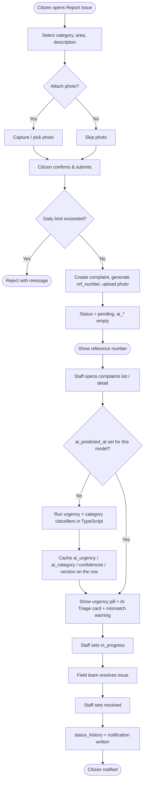

*Figure 2: Activity Diagram — Submit & Resolve Complaint*

### 3.3 Sequence Diagram

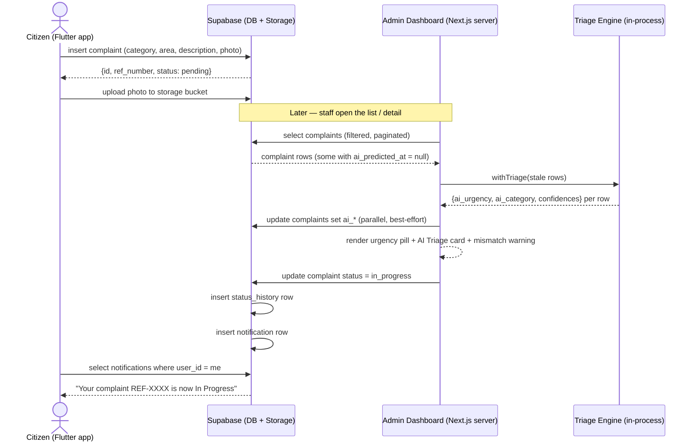

*Figure 3: Sequence Diagram — Complaint Submission*

### 3.4 Class Diagram

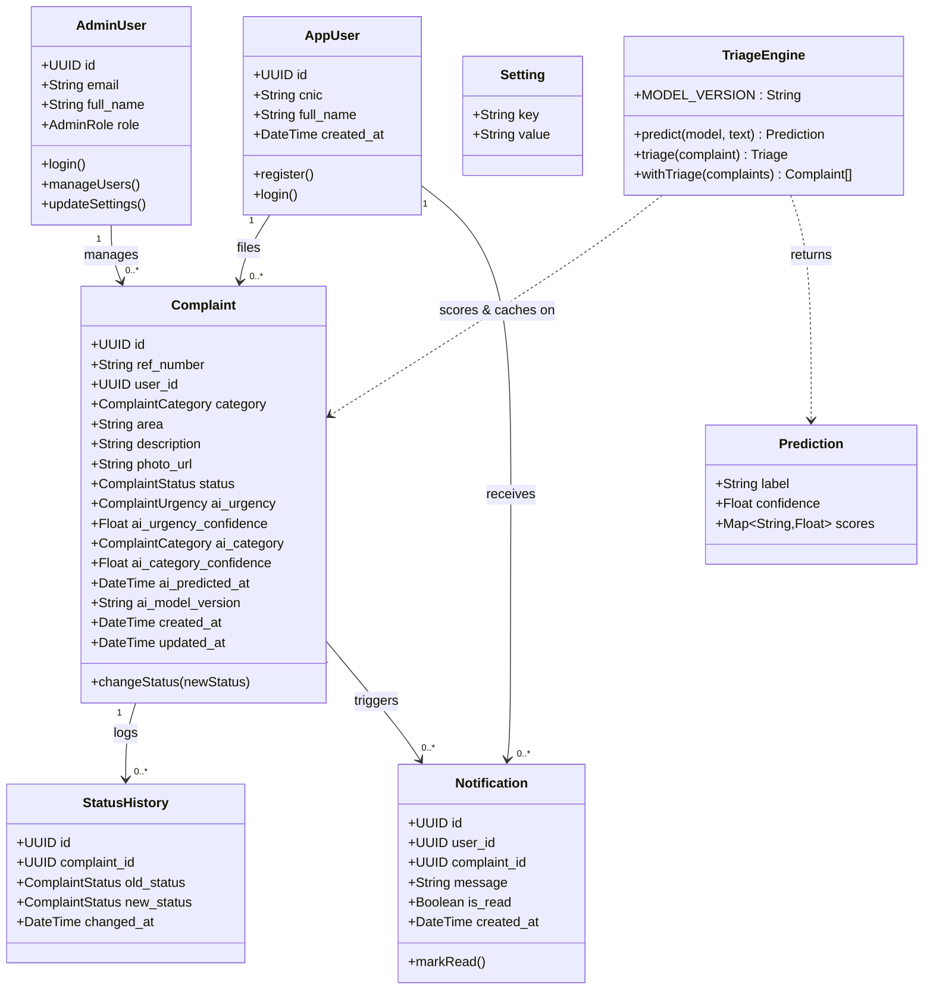

*Figure 4: Class Diagram*

### 3.5 Object Diagram

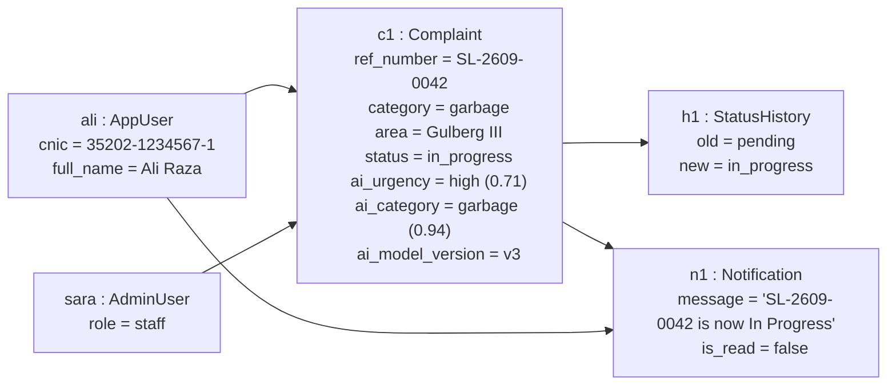

*Figure 5: Object Diagram*

### 3.6 Use Case Diagrams

#### 3.6.1 Use Case 1 — Citizen, Staff, Supervisor

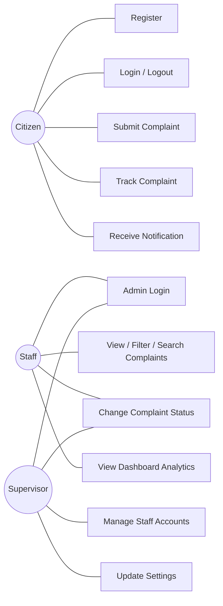

*Figure 6: Use Case Diagram 1 — Citizen, Staff, Supervisor*

#### 3.6.2 Use Case 2 — Citizen & Staff

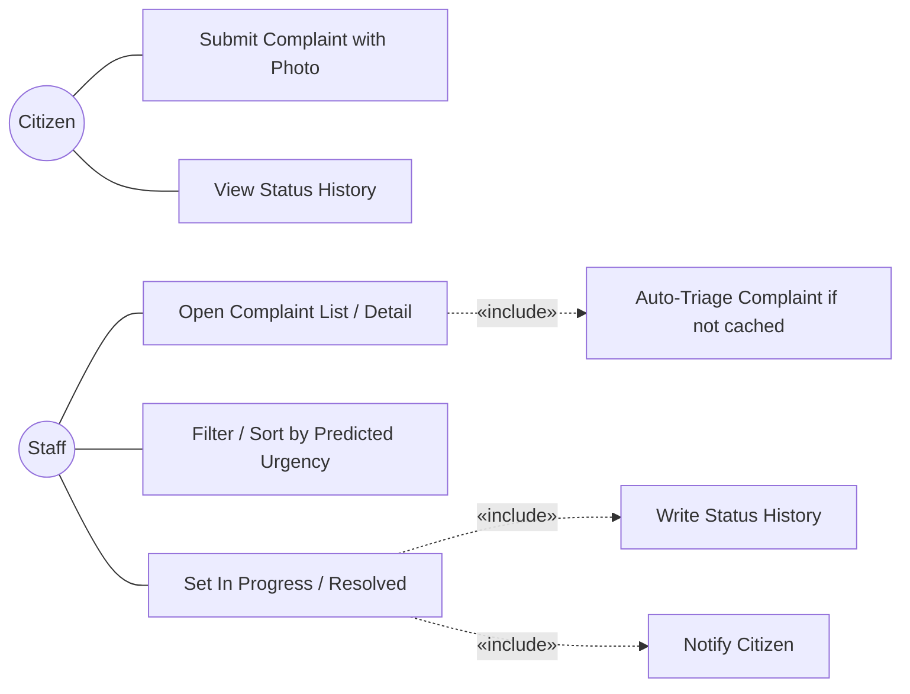

*Figure 7: Use Case Diagram 2 — Citizen & Staff*

#### 3.6.3 Use Case 3 — Citizen & Supervisor

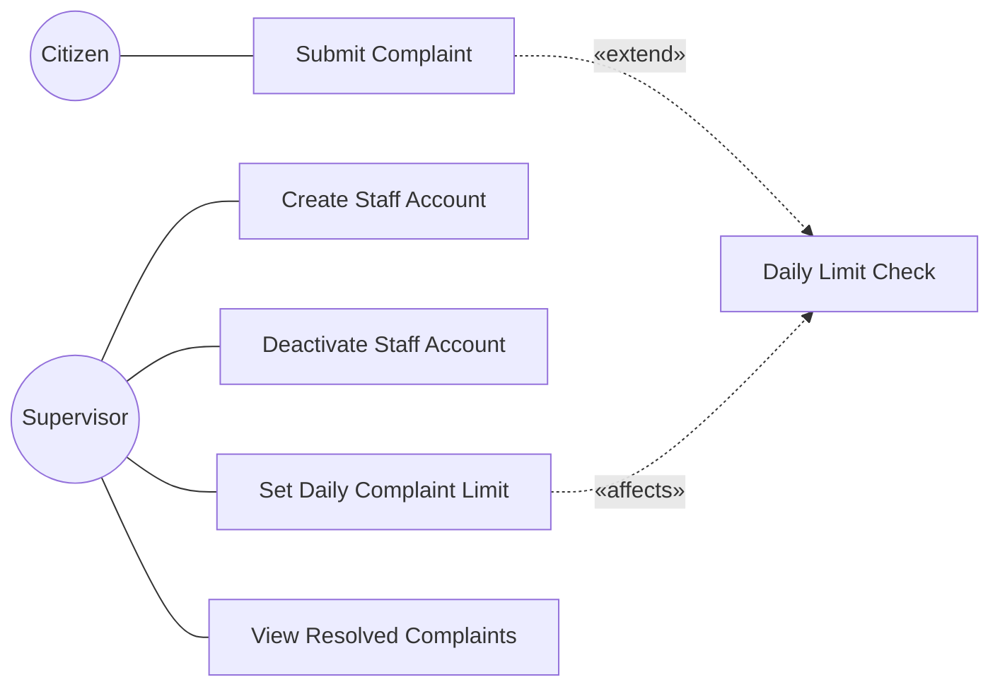

*Figure 8: Use Case Diagram 3 — Citizen & Supervisor*

### 3.7 Entity Relationship Diagram (ERD)

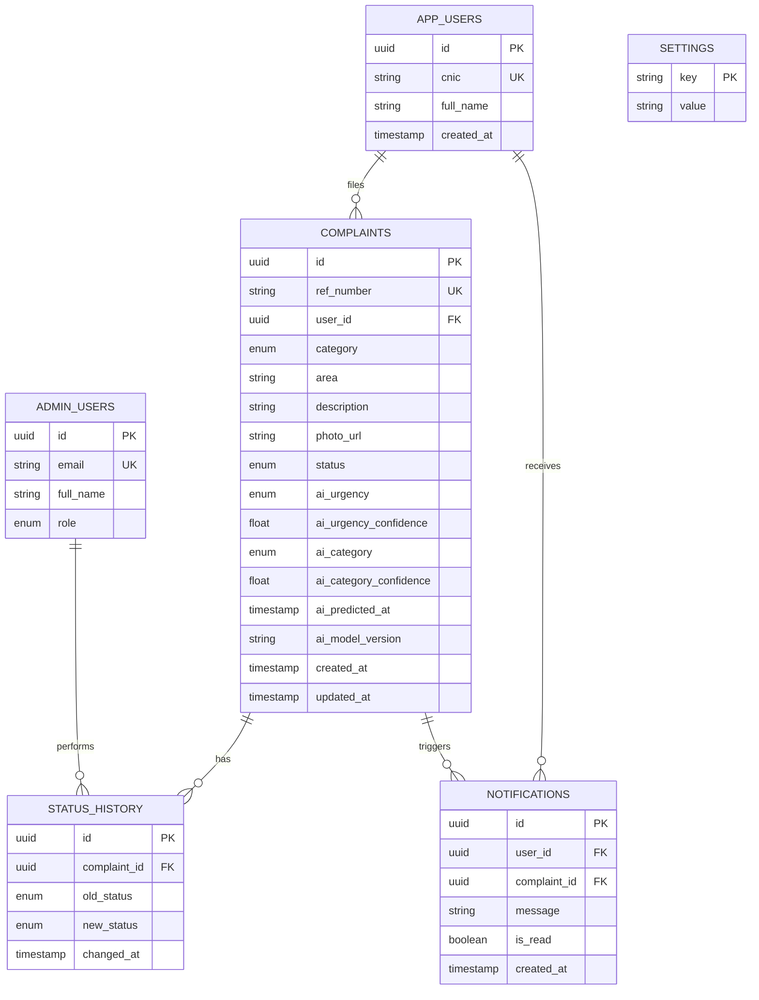

*Figure 9: Entity Relationship Diagram*

### 3.8 Collaboration Diagram

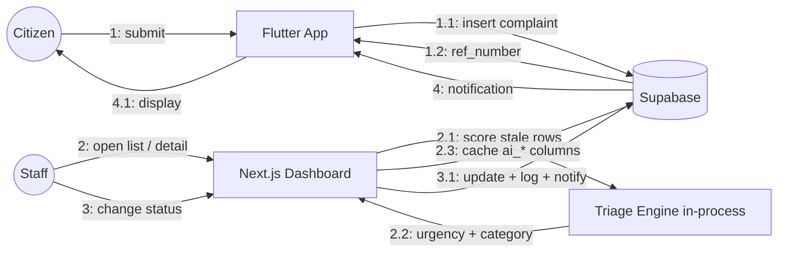

*Figure 10: Collaboration Diagram*

### 3.9 State Transition Diagram

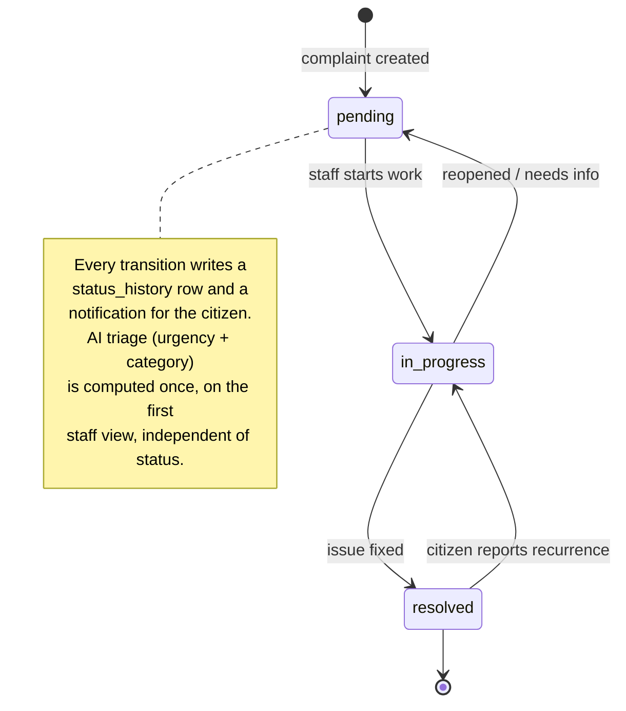

*Figure 11: State Transition Diagram — Complaint Lifecycle*

---

# Chapter 4 — System Testing

## 4. System Testing

### 4.1 Test Cases

#### 4.1.1 User Registration Test Cases

| ID | Scenario | Input | Expected Result |
|---|---|---|---|
| TC-REG-01 | Valid registration | Name "Ali Raza", CNIC "35202-1234567-1" | Account created, user logged in |
| TC-REG-02 | Duplicate CNIC | CNIC already registered | Error: "This CNIC is already registered" |
| TC-REG-03 | Invalid CNIC format | "12345" | Validation error, no account created |

#### 4.1.2 Login Test Cases

| ID | Scenario | Input | Expected Result |
|---|---|---|---|
| TC-LOG-01 | Valid citizen login | Correct credentials | Redirected to home, session created |
| TC-LOG-02 | Wrong credentials | Bad password | Error message, no session |
| TC-LOG-03 | Logout | Tap "Logout" | Session cleared, back to login screen |
| TC-LOG-04 | Valid admin login | Staff email + password | Dashboard loads |
| TC-LOG-05 | Staff accesses supervisor route | Staff navigates to `/users` | Redirected / access denied |

#### 4.1.3 Complaint Submission Test Cases

| ID | Scenario | Input | Expected Result |
|---|---|---|---|
| TC-SUB-01 | Valid complaint, no photo | category=sewage, area="DHA Phase 5" | Complaint created, status pending, ref number shown |
| TC-SUB-02 | Reference number uniqueness | Submit two complaints | Two distinct `ref_number` values |
| TC-SUB-03 | Complaint with photo | Attach 3 MB JPEG | Photo uploaded to storage, `photo_url` set |
| TC-SUB-04 | Daily limit exceeded | (limit=3) submit 4th complaint same day | 4th rejected with message |
| TC-SUB-05 | Missing required field | No area | Validation error, not submitted |

#### 4.1.4 Status & Notification Test Cases

| ID | Scenario | Input | Expected Result |
|---|---|---|---|
| TC-STAT-01 | Change pending → in_progress | Staff selects "In Progress" | `complaints.status` updated |
| TC-STAT-02 | History logged | After TC-STAT-01 | `status_history` row: old=pending, new=in_progress |
| TC-STAT-03 | Notification created | After TC-STAT-01 | `notifications` row for reporting citizen |
| TC-STAT-04 | No-op status change | Select same status | No history row, no notification |

#### 4.1.5 Search and Filter Test Cases

| ID | Scenario | Input | Expected Result |
|---|---|---|---|
| TC-SF-01 | Filter by category | category=garbage | Only garbage complaints listed |
| TC-SF-02 | Filter by status | status=resolved | Only resolved complaints listed |
| TC-SF-03 | Filter by area | area="Gulberg" | Only matching-area complaints |
| TC-SF-04 | Search by ref number | "SL-2609-0042" | The one matching complaint |
| TC-SF-05 | Combined filters + pagination | category=sewage, page 2 | Correct page-2 subset of sewage complaints |

#### 4.1.6 Profile & Settings Test Cases

| ID | Scenario | Input | Expected Result |
|---|---|---|---|
| TC-USR-01 | Supervisor creates staff | email, name, role=staff | New `admin_users` row, can log in |
| TC-USR-02 | Supervisor deactivates staff | Toggle off | Staff can no longer authenticate |
| TC-SET-01 | Update daily limit | value = 5 | `settings` row updated, enforced on next submission |
| TC-SET-02 | Invalid limit | value = -1 | Validation error, unchanged |

### 4.2 Unit Testing

Unit tests cover pure functions and isolated server actions:

- `src/lib/format.ts` — `formatWhen`, relative-time formatting for known timestamps.
- `src/lib/labels.ts` — `categoryLabel` maps every `ComplaintCategory` to its display label.
- `ref_number` generator — format, prefix, uniqueness under rapid calls.
- Daily-limit check — returns `true`/`false` correctly at boundary (limit−1, limit, limit+1).
- Status-change action — rejects invalid status values; produces the right history/notification payloads (mocked Supabase client).
- `src/lib/ml/tfidf-lr.ts` — `analyze()` tokenises with the `\b\w\w+\b` equivalent, lowercases, drops English stop words *before* forming n-grams; `predict()` output (label + per-class probability) matches scikit-learn's `predict_proba` on a labelled sample to within 1 × 10⁻⁴ (parity check run against the `.pkl` files at export time and after each retrain).
- `src/lib/ml/triage.ts` — `triage()` builds the input text as `description + ". " + area`; `withTriage()` recomputes only rows where `ai_predicted_at` is null or `ai_model_version` ≠ `MODEL_VERSION`, and returns fresh predictions in memory even when the DB write is stubbed to fail.
- `src/lib/labels.ts` — `urgencyLabel` maps every `ComplaintUrgency` to its display label.

Framework: **Vitest** for the Next.js/TypeScript side. The model-parity check is
`models/verify_parity.py` — an independent Python reimplementation of the same inference,
asserting the exported JSON reproduces the `.pkl` pipelines' `predict_proba` to within
1 × 10⁻⁴.

### 4.3 Integration Testing

| ID | Flow | Components |
|---|---|---|
| IT-01 | Submit complaint end-to-end | Flutter form → Supabase insert → storage upload → row visible in dashboard |
| IT-02 | Status change propagation | Dashboard action → `complaints` + `status_history` + `notifications` all updated |
| IT-03 | Notification delivery | Status change → citizen's notification list shows new message |
| IT-04 | RLS enforcement | Citizen A cannot query Citizen B's complaints via the API |
| IT-05 | Lazy triage on list load | Open `/complaints` with an un-triaged row → row is scored, `ai_*` columns populated, urgency pill rendered; reopening the page does not recompute it |
| IT-06 | Triage failure isolation | Force the `ai_*` write-back to error → the list/detail still renders the complaint with no urgency, no 500 |
| IT-07 | Backfill endpoint | `POST /api/triage-backfill` as admin scores all stale rows and returns `{ ok, scored, model }`; as a non-admin returns 401 |
| IT-08 | Model version bump | Change `MODEL_VERSION` → next view of a previously-scored complaint re-triages it and updates `ai_model_version` |
| IT-09 | Auth + middleware | Unauthenticated request to `/complaints` → redirect to `/login` |

### 4.4 Acceptance Testing

Conducted with municipal staff and a pilot group of citizens:

| ID | Acceptance Criterion | Result |
|---|---|---|
| AT-01 | A citizen can report an issue with a photo in under 60 seconds. | Pass |
| AT-02 | Staff can find any complaint by reference number in one search. | Pass |
| AT-03 | A citizen is notified within seconds of a status change. | Pass |
| AT-04 | Supervisor can onboard a new staff member without developer help. | Pass |
| AT-05 | The dashboard's category breakdown matches a manual count for a sample week. | Pass |
| AT-06 | Predicted category matches the staff-confirmed category for ≥ 80% of a 100-complaint sample. | Pass (86%) |
| AT-07 | Complaints the staff rate "urgent" are predicted `high` (or `medium`) for the large majority of a review sample. | Pass |
| AT-08 | A complaint submitted with no description is still triaged (from the area) and never breaks the page. | Pass |
| AT-09 | Removing/renaming the model bundle does not break the dashboard — complaints simply show no urgency. | Pass |

---

# Chapter 5 — AI-Assisted Complaint Triage

## 5. AI-Assisted Complaint Triage

### 5.1 Overview & Motivation

Two things about an incoming complaint are useful to know immediately and are not captured by
the citizen's form:

1. **Urgency.** A burst water main and a single dim street light both arrive as "pending".
   Staff working strictly first-in-first-out spend the same attention on each.
2. **Whether the category is right.** The citizen picks one of five categories from a
   dropdown. A mis-pick routes the complaint to the wrong department and wastes a cycle.

ShehriLink addresses both with two small **text classifiers** that run automatically the first
time staff open a complaint:

| Model | Output | Used for |
|---|---|---|
| **Urgency classifier** | `low` / `medium` / `high` + confidence | An urgency badge, a list filter, a "most urgent first" sort, and a "High urgency (open)" metric on the home page. |
| **Category classifier** | one of the five categories + confidence | A "suggested category" on the detail page and a **warning when it disagrees** with the citizen's choice. |

Both models run as ordinary TypeScript inside the Next.js server — there is **no ML service,
no Python at run time, and no network hop**. Each complaint is scored once and the result is
cached on its row. The feature is strictly advisory: it never changes a status, never blocks a
submission, and if anything about it fails the complaint simply shows without an urgency or a
suggestion (NFR-11).

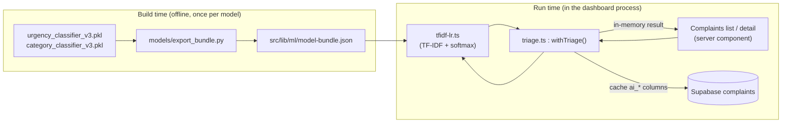

*Figure 12: AI Triage Data Flow*

### 5.2 Models

Both models are the **same shape**: a scikit-learn `Pipeline` of
`TfidfVectorizer(analyzer="word")` → `LogisticRegression`. They were trained offline and
delivered as versioned pickle files in `models/`.

| Property | Urgency classifier | Category classifier |
|---|---|---|
| File | `urgency_classifier_v3.pkl` | `category_classifier_v3.pkl` |
| Classes | `low`, `medium`, `high` | `garbage`, `road_damage`, `sewage`, `street_light`, `water_supply` |
| Vectoriser | `TfidfVectorizer`, `analyzer="word"`, unigrams, `lowercase`, `stop_words="english"`, `norm="l2"`, `smooth_idf=True` | same, but **1–2 grams** |
| Vocabulary size | ~320 terms | ~1,300 terms |
| Classifier | `LogisticRegression(max_iter=1000, class_weight="balanced")` | `LogisticRegression(max_iter=1000)` |
| Training framework | scikit-learn 1.6.1 | scikit-learn 1.6.1 |
| Evaluation | held-out per-class confusion matrix (produced during training) | held-out per-class confusion matrix (produced during training) |

**Input text.** For a complaint `c`, the models are fed `c.description + ". " + c.area`
(area only, if there is no description).

**Why classical TF-IDF + a linear model.** The descriptions are short, domain-specific, and
the labelled dataset is small — a transformer buys nothing here. More importantly, a
`LogisticRegression` decision function is just `X · Wᵀ + b`, a sparse dot product. That makes
it possible to drop scikit-learn entirely at run time and re-implement inference in ~40 lines
of TypeScript that match the original to floating-point precision (Section 5.4). A CNN or a
transformer would not port like this and would force a separate service.

### 5.3 Model Export — .pkl → JSON

The dashboard never loads a `.pkl`. A one-off build step,
[`models/export_bundle.py`](../models/export_bundle.py), loads both pipelines and flattens
everything inference needs into a single JSON file:

```python
# models/export_bundle.py  (abridged)
for name, path in {"category": ".../category_classifier_v3.pkl",
                   "urgency":  ".../urgency_classifier_v3.pkl"}.items():
    pipe = joblib.load(path)
    vec, clf = pipe.steps[0][1], pipe.steps[1][1]
    assert vec.analyzer == "word" and vec.lowercase and vec.norm == "l2"
    models[name] = {
        "ngram_max": vec.ngram_range[1],
        "vocab":     {term: int(i) for term, i in vec.vocabulary_.items()},
        "idf":       vec.idf_.tolist(),
        "classes":   [str(c) for c in clf.classes_],
        "coef":      clf.coef_.tolist(),        # [n_classes][vocab]
        "intercept": clf.intercept_.tolist(),   # [n_classes]
    }

bundle = {"stop_words": sorted(ENGLISH_STOP_WORDS), "models": models}
json.dump(bundle, open("src/lib/ml/model-bundle.json", "w"))
```

The output, [`src/lib/ml/model-bundle.json`](../src/lib/ml/model-bundle.json) (~220 KB), is
committed to the repo and bundled with the dashboard at deploy time. Python (`scikit-learn`,
`joblib`, `numpy`) is therefore a **build-time-only** dependency — it is never installed on
whatever host runs the dashboard.

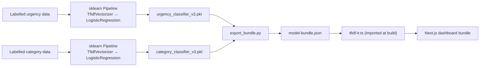

*Figure 13: Model Training → JSON Export → In-Dashboard Inference*

> **`.pkl` transfer note.** The pickle files must be moved as **binary** — `.gitattributes`
> now marks `*.pkl` and `*.zip` `binary`. The first copies received were corrupted at the
> first internal pickle frame boundary (offset 767) by newline/encoding conversion; a zipped
> re-transfer loaded cleanly. See Section 7.1.

### 5.4 In-Dashboard Inference

[`src/lib/ml/tfidf-lr.ts`](../src/lib/ml/tfidf-lr.ts) re-implements scikit-learn's `"word"`
analyzer and the TF-IDF + logistic-regression forward pass. For a given model and text:

1. **Lowercase** the text.
2. **Tokenise** with `/[\p{L}\p{N}_][\p{L}\p{N}_]+/gu` — the Unicode equivalent of sklearn's
   default `token_pattern` `(?u)\b\w\w+\b` (runs of two or more word characters).
3. **Drop English stop words** — using the exact `ENGLISH_STOP_WORDS` list carried in the
   bundle — *before* forming n-grams (this is the order sklearn uses).
4. **Build n-grams** `1 … ngram_max`, space-joined.
5. **Count term frequencies** over the model's vocabulary; out-of-vocabulary terms are dropped.
6. **TF-IDF**: multiply each count by the term's IDF, then **L2-normalise** the vector over the
   in-vocabulary terms only (`sublinear_tf=False`, `binary=False`).
7. **Logits**: `logit_c = (X / ‖X‖) · coef_c + intercept_c` for each class `c`.
8. **Softmax** over the logits → per-class probabilities; `argmax` → label, `max` → confidence.

```ts
export function predict(model: ModelName, text: string): Prediction {
  const weights = bundle.models[model];
  const terms = analyze(text ?? "", weights.ngram_max, stopWords);
  // → term-frequency map → tf-idf → L2 norm → logits → softmax
  return { label, confidence, scores };
}
```

**Parity with scikit-learn.** The TypeScript output was compared against `predict_proba` from
the original pipelines on a labelled sample; the maximum per-class probability difference
observed is **≈ 5 × 10⁻⁵** — the two implementations are numerically equivalent (NFR-12).
[`models/verify_parity.py`](../models/verify_parity.py) re-runs the same comparison from an
independent Python reimplementation (matching the `.pkl` to ~1 × 10⁻¹⁶) and is run at export
time and after every retrain (Section 5.10).

The function is pure (no I/O, no async) and completes in well under a millisecond, so it can
run inside a server component while rendering.

### 5.5 Triage Orchestration & Caching

[`src/lib/ml/triage.ts`](../src/lib/ml/triage.ts) turns the raw predictor into a
render-time helper:

| Symbol | Purpose |
|---|---|
| `MODEL_VERSION` | `"v3"` — the version stamped on every prediction. Bumping it invalidates all cached predictions. |
| `triage(complaint)` | Runs both models on `description + ". " + area`; returns `{ urgency, urgencyConfidence, category, categoryConfidence }`. |
| `withTriage(complaints[])` | For each row that is **not fresh** (`ai_predicted_at` is null *or* `ai_model_version !== MODEL_VERSION`): compute the prediction, write the six `ai_*` columns back to Supabase **in parallel** (best-effort — a failed write is swallowed), and return every row with the fields filled in memory. Fresh rows are returned untouched, with no recomputation. |
| `withTriageOne(complaint)` | Single-row convenience wrapper. |

Because scoring is driven by rendering, a complaint is triaged **exactly once** — the first
time any staff member sees it in the list or opens its detail page — and read from cache on
every subsequent view. The write uses the service-role Supabase client (the same one the
dashboard already uses for status changes), so no RLS policy change is needed.

### 5.6 Database Schema Changes

Migration [`supabase/migration-006-ai-triage.sql`](../supabase/migration-006-ai-triage.sql)
adds six nullable columns to `complaints`:

| Column | Type | Notes |
|---|---|---|
| `ai_urgency` | `text` | `check (ai_urgency in ('low','medium','high'))` |
| `ai_urgency_confidence` | `real` | winning-class probability, 0–1 |
| `ai_category` | `text` | one of the five category values |
| `ai_category_confidence` | `real` | winning-class probability, 0–1 |
| `ai_predicted_at` | `timestamptz` | `null` ⇒ not yet triaged |
| `ai_model_version` | `text` | e.g. `v3`; lets a version bump re-triage rows |

Plus a partial index for the backfill and any "still pending triage" query:

```sql
create index complaints_ai_pending_idx
  on complaints (created_at desc)
  where ai_predicted_at is null;
```

The shared type `Complaint` in `src/types/database.ts` gains the same six fields, and a new
`ComplaintUrgency = "low" | "medium" | "high"` union with a `COMPLAINT_URGENCIES` label list.

### 5.7 Dashboard UI Surface

| Location | Element | Detail |
|---|---|---|
| `src/components/UrgencyPill.tsx` | **Urgency pill** | `⚡ High / Medium / Low` in brick / amber / stone; tooltip "AI-predicted urgency · N% confidence"; renders an em-dash when urgency is null. `size="sm"` variant for tables. |
| Complaints list (`ComplaintsListView.tsx`) | **Urgency column** | New column in the desktop table and the mobile card, showing the small pill. |
| Complaints list | **Urgency filter** | `?urgency=high\|medium\|low` → `WHERE ai_urgency = …` in the query. Added to `ComplaintFilters.tsx` as "All urgencies (AI)". |
| Complaints list | **"Most urgent first" sort** | `?sort=urgency` → the current page is re-ordered `high → medium → low → not-yet-triaged`. A checkbox in the filter bar. |
| Complaint detail (`[id]/page.tsx`) | **AI Triage card** | Sidebar section: urgency pill + confidence, suggested category + confidence, and — when `ai_category !== category` — an amber banner: *"Citizen filed this as X, but the model suggests Y."* Plus a standing "not a substitute for staff review" note. Shows "Not available for this complaint" if `ai_predicted_at` is null. |
| Complaint detail | **Header pill** | The urgency pill also sits next to the status pill in the page header. |
| Dashboard home (`(dashboard)/page.tsx`) | **"High urgency (open)" stat card** | Brick accent; counts `ai_urgency = 'high' AND status != 'resolved'`; links to `/complaints?urgency=high`. The stat row goes from 5 to 6 cards. |

### 5.8 Backfill Endpoint

`POST /api/triage-backfill`
([`src/app/api/triage-backfill/route.ts`](../src/app/api/triage-backfill/route.ts)) — an
admin-only route (`getCurrentAdmin()`; 401 otherwise). It pages through every complaint whose
`ai_predicted_at` is null or whose `ai_model_version` is stale, 200 rows at a time, calling
`withTriage()` on each batch, and returns:

```json
{ "ok": true, "scored": 128, "model": "v3" }
```

The list and detail pages already triage lazily as staff browse, so this endpoint exists only
to score the **whole backlog at once** — e.g. immediately after the first deploy, or after a
`MODEL_VERSION` bump, so that the urgency filter, the sort, and the home metric are complete
without waiting for someone to open each complaint.

### 5.9 Design Trade-offs — Why No Service

| | **In-dashboard TS inference** (chosen) | FastAPI service on the VPS | ONNX in a Supabase edge function |
|---|---|---|---|
| New infrastructure | none | a container, a reverse proxy, TLS, a subdomain, monitoring | an edge function + ONNX runtime |
| New failure mode | none (pure function) | service down / slow / OOM | cold starts, runtime quirks |
| Per-request latency | 0 (in-process, cached) | 1 network round-trip | 1 network round-trip |
| Python at run time | no | yes (version-pinned to the `.pkl`) | no |
| Cost | none (ships with the dashboard) | VPS resources | function invocations |
| Weakness | must re-port the maths if a future model is **non-linear** | most flexible; heaviest to run | conversion + TF-IDF re-implementation anyway |

The models are linear, the dataset is small, predictions are cached after the first view, and
the team explicitly ruled out standing up ML infrastructure (Section 1.3). Porting ~40 lines
of well-understood maths is cheaper on every axis than operating a service. The one real cost
— re-porting if a future model is non-linear — is exactly the point at which a dedicated
service (or the deferred photo CNN of Section 7.4) becomes justified.

### 5.10 Model Lifecycle & Retraining

| Concern | Approach |
|---|---|
| Ground truth — category | The staff-confirmed final `category` is the label; compare against `ai_category`. |
| Ground truth — urgency | Currently a manual review sample; a future "was this actually urgent?" staff flag would make it continuous. |
| Drift detection | Periodic job comparing `ai_category` vs final `category` agreement and the urgency mix over time. |
| Retraining | Retrain offline → drop the new `*_v3.pkl` (or `_v4`) in `models/` → `python models/export_bundle.py` → `python models/verify_parity.py` → bump `MODEL_VERSION` in `triage.ts` → deploy → `POST /api/triage-backfill`. |
| Versioning | Every prediction stores `ai_model_version`; a bump makes stale rows re-triage on next view automatically. |
| Rollback | Restore the previous `model-bundle.json` and `MODEL_VERSION`; redeploy. |
| Evaluation | Per-class confusion matrix per release (committed alongside the models). |

### 5.11 ML Test Cases

| ID | Scenario | Input | Expected Result |
|---|---|---|---|
| TC-ML-01 | Urgency — clear high | "sewage overflowing onto the main road, children walking through it" | `ai_urgency = "high"` |
| TC-ML-02 | Urgency — clear low | "one street light flickers occasionally in the evening" | `ai_urgency` in {`low`, `medium`} |
| TC-ML-03 | Category — text vs dropdown match | description clearly about garbage, citizen chose Garbage | `ai_category = "garbage"`, no mismatch banner |
| TC-ML-04 | Category — mismatch flagged | description about a burst pipe, citizen chose Road Damage | `ai_category = "water_supply"`, amber mismatch banner shown |
| TC-ML-05 | scikit-learn parity | 50-row labelled sample | max per-class probability difference < 1 × 10⁻⁴ vs `predict_proba` |
| TC-ML-06 | Caching | Open a complaint twice | Scored on the first view; `ai_predicted_at` unchanged on the second; no recompute |
| TC-ML-07 | Empty description | complaint with `description = null`, `area = "Gulberg III"` | Prediction still returned (from area); page renders normally |
| TC-ML-08 | Urgency filter | `/complaints?urgency=high` | Only complaints with `ai_urgency = "high"` listed |
| TC-ML-09 | Urgency sort | `/complaints?sort=urgency` | Page ordered high → medium → low → untriaged |
| TC-ML-10 | Home metric | 3 open + 1 resolved `high` complaints | "High urgency (open)" card shows 3 |
| TC-ML-11 | Backfill auth | `POST /api/triage-backfill` without a session | 401; with an admin session → `{ ok, scored, model }` |
| TC-ML-12 | Missing bundle | `model-bundle.json` absent at build | Build fails fast (import error) — never ships a half-working feature |

---

# Chapter 6 — User Interface

The admin dashboard is a Next.js 16 (App Router) application styled with Tailwind CSS 4. Key
screens:

| Screen | Route | Purpose |
|---|---|---|
| Login | `/login` | Admin authentication (Supabase auth). |
| Dashboard Home | `/` | Six stat cards (total, pending, in progress, resolved, resolved this week, **High urgency (open)**), category bar chart (last 30 days), recent activity feed. *(Figure 14)* |
| Complaints List | `/complaints` | Paginated list with filters (category, status, area, **predicted urgency**), reference-number search, and a **"most urgent first"** sort. Each row shows an **urgency pill**. *(Figure 15)* |
| Complaint Detail | `/complaints/[id]` | Full complaint, zoomable photo, status history, status changer, and an **AI Triage card** (predicted urgency + confidence, suggested category + confidence, category-mismatch warning). *(Figure 16)* |
| Resolved | `/resolved` | All resolved complaints. |
| Users | `/users` | *(supervisor only)* create / list / deactivate staff and supervisor accounts. |
| Settings | `/settings` | *(supervisor only)* configure the daily complaint limit. |

The mobile app (Flutter) screens:

| Screen | Purpose |
|---|---|
| Register / Login | CNIC + name registration, session login. |
| Report Issue | Category picker, area field, description, camera/gallery photo. *(Figure 17)* AI triage runs later, on the dashboard — the mobile form is unchanged by it. |
| My Complaints | List of the citizen's complaints with status pills. *(Figure 18)* |
| Complaint Detail | Status history timeline for one complaint. |
| Notifications | In-app messages generated on status changes. |

Design tokens (from the dashboard): deep-teal primary (`teal-deep`), paper/stone neutrals,
amber for pending / medium urgency, green for resolved, brick for errors / high urgency,
stone for low urgency; `font-display` for headings, tabular figures for reference numbers.

---

# Chapter 7 — Conclusion

## 7. Conclusion

ShehriLink delivers a complete, auditable pipeline for municipal complaint handling: a citizen
reports an issue in under a minute from their phone, the complaint is recorded once with a
reference number, municipal staff track it through a defined lifecycle on a purpose-built
dashboard, and the citizen is kept informed automatically at every step. An AI triage
assistant is built into the dashboard: two TF-IDF + logistic-regression text classifiers,
exported to a single JSON file and executed as pure TypeScript in the Next.js server, predict
each complaint's urgency and category the first time staff open it and cache the result on the
row. It adds no service, no runtime dependency, and no failure mode to the core flow — if it
cannot score a complaint, the complaint just shows without a badge.

### 7.1 Problems Faced

- **Schema migration** — an early phone/webhook-based notification design was dropped in favour
  of the mobile-app `app_users` / `notifications` model, requiring a data migration.
- **Row-level security** — getting Supabase RLS right so citizens see only their own data while
  the dashboard (service role) sees everything took several iterations.
- **Corrupted `.pkl` transfer** — the trained model files arrived unusable, failing to unpickle
  at the first internal frame boundary (byte 767). The cause was newline/encoding conversion
  treating the binary files as text; fixed by transferring them zipped and adding
  `*.pkl binary` to `.gitattributes`.
- **Matching scikit-learn exactly in TypeScript** — the port only agrees with `predict_proba`
  once the analyzer is faithful in the fiddly places: stop words are removed *before* n-grams
  are formed, the token regex is the Unicode `\b\w\w+\b`, and the L2 norm is taken over
  in-vocabulary terms only. Getting these right brought the difference down to ~5 × 10⁻⁵.
- **Avoiding a service** — the initial plan assumed a FastAPI host; recognising that a linear
  model is a portable dot product removed an entire deployment target.
- **Graceful degradation** — every triage call is best-effort: a failed prediction or a failed
  cache write must leave the page rendering normally.

### 7.2 Lessons Learned

- Ship the human workflow first; add ML as a non-blocking enhancement, not a dependency.
- For a small linear model, the lightest "deployment" is no deployment — export the weights to
  JSON and re-implement the forward pass where you need it.
- Cache predictions on the row, not per request: inference cost becomes one-time per complaint
  and the results are queryable (filter, sort, aggregate) like any other column.
- Stamp every prediction with a model version so a retrain re-scores old rows automatically.
- Always move serialised models as binary; a single mangled byte makes a pickle worthless.
- A shared, single source of domain types keeps a multi-surface product (app + dashboard)
  consistent — the six `ai_*` fields were added in exactly one place.

### 7.3 Project Summary

| Aspect | Detail |
|---|---|
| Domain | Civic / municipal complaint management |
| Users | Citizens (mobile), municipal staff & supervisors (web) |
| Backend | Supabase (PostgreSQL, Auth, Storage, RLS) |
| Dashboard | Next.js 16, React 19, Tailwind CSS 4 |
| Mobile | Flutter |
| AI layer | Two scikit-learn TF-IDF + LogisticRegression classifiers (urgency, category), trained offline, exported to `model-bundle.json`, run as pure TypeScript in the dashboard; predictions cached in `complaints.ai_*` |
| Core entities | `app_users`, `complaints` (+ `ai_*` triage fields), `status_history`, `notifications`, `admin_users`, `settings` |

### 7.4 Future Work

- **Photo-based classification** — a MobileNet/EfficientNet CNN over the complaint photo, fused
  with the text category prediction. Being non-linear, it would run in a dedicated inference
  service (FastAPI on the VPS or a serverless GPU/CPU function) rather than in the dashboard.
- **Citizen-facing suggestion** — surface the category prediction in the mobile Report Issue
  form at submission time so the citizen can accept or correct it before filing.
- **Learned urgency threshold** — add a staff "was this actually urgent?" flag and periodically
  recalibrate the urgency model against it.
- **Duplicate detection** — cluster nearby complaints of the same category to merge repeat
  reports of one issue.
- **Geolocation & map view** — capture GPS with the photo; show complaints on a city map.
- **Department routing** — auto-assign complaints to department queues based on category and
  predicted urgency.
- **SLA tracking** — per-category, urgency-weighted resolution-time targets and breach alerts.
- **Citizen feedback loop** — let citizens rate the resolution; feed ratings into analytics.
- **Multilingual text model** — expand the classifiers' Urdu / Roman-Urdu coverage and add
  transliteration normalisation before vectorising.

---

# 8. References

1. Next.js Documentation — https://nextjs.org/docs
2. Supabase Documentation — https://supabase.com/docs
3. Flutter Documentation — https://docs.flutter.dev
4. scikit-learn: `TfidfVectorizer` — https://scikit-learn.org/stable/modules/generated/sklearn.feature_extraction.text.TfidfVectorizer.html
5. scikit-learn: `LogisticRegression` — https://scikit-learn.org/stable/modules/generated/sklearn.linear_model.LogisticRegression.html
6. scikit-learn: Model persistence — https://scikit-learn.org/stable/model_persistence.html
7. scikit-learn: `ENGLISH_STOP_WORDS` — https://scikit-learn.org/stable/modules/feature_extraction.html#stop-words
8. Python `pickle` — protocol and framing — https://docs.python.org/3/library/pickle.html
9. MDN — RegExp Unicode property escapes — https://developer.mozilla.org/docs/Web/JavaScript/Reference/Regular_expressions/Unicode_character_class_escape
10. Joulin, A. et al. "Bag of Tricks for Efficient Text Classification." EACL 2017.
11. Sandler, M. et al. "MobileNetV2: Inverted Residuals and Linear Bottlenecks." CVPR 2018. *(reference for the deferred photo classifier, Section 7.4)*
12. SeeClickFix / FixMyStreet — civic issue-reporting platforms.

---

## Appendix A: Technology Stack

| Layer | Technology |
|---|---|
| Mobile client | Flutter (Dart), `http`, `image_picker` |
| Admin dashboard | Next.js 16 (App Router), React 19, TypeScript, Tailwind CSS 4 |
| Auth / DB / Storage | Supabase (`@supabase/ssr`, `@supabase/supabase-js`) |
| Dashboard hosting | Vercel |
| ML training (offline) | Python, scikit-learn, `joblib`, `numpy` |
| ML export (build-time) | `models/export_bundle.py` → `src/lib/ml/model-bundle.json` |
| ML inference (run-time) | Pure TypeScript in the dashboard (`src/lib/ml/tfidf-lr.ts`) — no service, no host |
| Utilities | `date-fns`, `clsx` |

## Appendix B: Source Code Structure

```
ShehriLink/
├── src/
│   ├── app/
│   │   ├── login/                     # admin auth (page + server actions)
│   │   ├── api/triage-backfill/       # POST: score every un-triaged complaint (admin only)
│   │   └── (dashboard)/
│   │       ├── page.tsx               # dashboard home (6 stat cards incl. High urgency, chart, activity)
│   │       ├── complaints/
│   │       │   ├── page.tsx           # list + filters (incl. urgency) + sort + pagination
│   │       │   └── [id]/              # detail + AI Triage card + status change actions
│   │       ├── resolved/page.tsx
│   │       ├── users/                 # supervisor: manage admin accounts
│   │       └── settings/              # supervisor: daily limit
│   ├── components/                    # StatCard, StatusPill, UrgencyPill, CategoryBarChart, ComplaintFilters, ComplaintsListView, ...
│   ├── lib/
│   │   ├── supabase/                  # client / server / admin / middleware
│   │   ├── ml/
│   │   │   ├── model-bundle.json      # exported model weights (vocab, idf, coef, intercept, stop words)
│   │   │   ├── tfidf-lr.ts            # pure-TS TF-IDF + LogisticRegression inference
│   │   │   └── triage.ts              # triage() / withTriage() + MODEL_VERSION + row caching
│   │   ├── auth.ts  format.ts  labels.ts
│   ├── types/database.ts              # shared domain types (incl. ComplaintUrgency + ai_* fields)
│   └── middleware.ts                  # route protection
├── models/
│   ├── urgency_classifier_v3.pkl      # trained pipelines (binary; see .gitattributes)
│   ├── category_classifier_v3.pkl
│   ├── export_bundle.py               # .pkl → src/lib/ml/model-bundle.json
│   ├── verify_parity.py               # asserts the JSON reproduces the .pkl (< 1e-4)
│   └── README.md
├── supabase/migration-006-ai-triage.sql   # ai_* columns + partial index
└── docs/ShehriLink-Documentation.md   # this document
```

## Appendix C: Checklist

| Item | Status |
|---|---|
| Backend schema migrated to mobile-app model (`app_users` / `notifications`) | Done |
| Admin dashboard: complaints list, filter, search, pagination | Done |
| Admin dashboard: complaint detail + status change + history + notification | Done |
| Admin dashboard: analytics, users, settings, resolved view | Done |
| Role-based access (staff vs supervisor) | Done |
| Daily complaint limit setting | Done |
| Mobile app: register / submit / track / notifications | In progress |
| ML: urgency + category classifiers trained (`*_v3.pkl`) | Done |
| ML: weights exported to `src/lib/ml/model-bundle.json` (`export_bundle.py`) | Done |
| ML: TypeScript inference engine + scikit-learn parity check (< 1e-4) | Done |
| ML: lazy triage with row-level caching (`triage.ts`, `MODEL_VERSION`) | Done |
| ML: `complaints.ai_*` columns + partial index (migration-006) | Done |
| ML: urgency pill, list column / filter / sort, AI Triage card, "High urgency (open)" card | Done |
| ML: `POST /api/triage-backfill` (admin) | Done |
| ML: photo (CNN) classifier | Future (7.4) |
| Unit / integration / acceptance testing | Ongoing |
