# ShehriLink — Project Documentation

**A civic complaint reporting and resolution platform for local municipalities**

| | |
|---|---|
| Project title | ShehriLink |
| Document version | 1.0 |
| Date | 2 September 2026 |
| Prepared by | Project Team, Business Upscalers |

---

## Table of Contents

- [Chapter 1 — Introduction](#chapter-1--introduction)
  - [1.1 Objectives](#11-objectives)
  - [1.2 Problem Statement](#12-problem-statement)
  - [1.3 Assumptions & Constraints](#13-assumptions--constraints)
- [Chapter 2 — Requirement Analysis](#chapter-2--requirement-analysis)
  - [2.1 Literature Review](#21-literature-review)
  - [2.2 List of Stakeholders](#22-list-of-stakeholders)
  - [2.3 Functional Requirements](#23-functional-requirements)
  - [2.4 Non-Functional Requirements](#24-non-functional-requirements)
  - [2.5 Requirements Traceability Matrix (RTM)](#25-requirements-traceability-matrix-rtm)
  - [2.6 Use Case Descriptions](#26-use-case-descriptions)
  - [2.7 Software Development Life Cycle Model](#27-software-development-life-cycle-model)
- [Chapter 3 — System Design](#chapter-3--system-design)
  - [3.1 Work Breakdown Structure (WBS)](#31-work-breakdown-structure-wbs)
  - [3.2 Activity Diagram](#32-activity-diagram)
  - [3.3 Sequence Diagram](#33-sequence-diagram)
  - [3.4 Class Diagram](#34-class-diagram)
  - [3.5 Object Diagram](#35-object-diagram)
  - [3.6 Use Case Diagrams](#36-use-case-diagrams)
  - [3.7 Entity Relationship Diagram (ERD)](#37-entity-relationship-diagram-erd)
  - [3.8 Collaboration Diagram](#38-collaboration-diagram)
  - [3.9 State Transition Diagram](#39-state-transition-diagram)
- [Chapter 4 — System Testing](#chapter-4--system-testing)
  - [4.1 Test Cases](#41-test-cases)
  - [4.2 Unit Testing](#42-unit-testing)
  - [4.3 Integration Testing](#43-integration-testing)
  - [4.4 Acceptance Testing](#44-acceptance-testing)
- [Chapter 5 — AI / Machine Learning Integration](#chapter-5--ai--machine-learning-integration)
  - [5.1 Overview & Motivation](#51-overview--motivation)
  - [5.2 Models](#52-models)
  - [5.3 Model Export Strategy](#53-model-export-strategy)
  - [5.4 Integration Paths](#54-integration-paths)
  - [5.5 Recommended Architecture](#55-recommended-architecture)
  - [5.6 Inference API Specification](#56-inference-api-specification)
  - [5.7 Deployment on the Contabo VPS](#57-deployment-on-the-contabo-vps)
  - [5.8 Flutter Client Integration](#58-flutter-client-integration)
  - [5.9 Model Lifecycle, Monitoring & Retraining](#59-model-lifecycle-monitoring--retraining)
  - [5.10 ML Test Cases](#510-ml-test-cases)
- [Chapter 6 — User Interface](#chapter-6--user-interface)
- [Chapter 7 — Conclusion](#chapter-7--conclusion)
  - [7.1 Problems Faced](#71-problems-faced)
  - [7.2 Lessons Learned](#72-lessons-learned)
  - [7.3 Project Summary](#73-project-summary)
  - [7.4 Future Work](#74-future-work)
- [8. References](#8-references)
- [Appendix A: Technology Stack](#appendix-a-technology-stack)
- [Appendix B: Source Code Structure](#appendix-b-source-code-structure)
- [Appendix C: Checklist](#appendix-c-checklist)

---

## List of Figures

| Figure | Title | Section |
|---|---|---|
| Figure 1 | Work Breakdown Structure (WBS) | 3.1 |
| Figure 2 | Activity Diagram — Submit & Resolve Complaint | 3.2 |
| Figure 3 | Sequence Diagram — Complaint Submission | 3.3 |
| Figure 4 | Class Diagram | 3.4 |
| Figure 5 | Object Diagram | 3.5 |
| Figure 6 | Use Case Diagram 1 — Citizen, Staff, Supervisor | 3.6.1 |
| Figure 7 | Use Case Diagram 2 — Citizen & Staff | 3.6.2 |
| Figure 8 | Use Case Diagram 3 — Citizen & Supervisor | 3.6.3 |
| Figure 9 | Entity Relationship Diagram | 3.7 |
| Figure 10 | Collaboration Diagram | 3.8 |
| Figure 11 | State Transition Diagram — Complaint Lifecycle | 3.9 |
| Figure 12 | ML Inference Architecture | 5.5 |
| Figure 13 | Model Training → Export → Serving Pipeline | 5.3 |
| Figure 14 | Admin Dashboard — Home | 6 |
| Figure 15 | Admin Dashboard — Complaints List | 6 |
| Figure 16 | Admin Dashboard — Complaint Detail | 6 |
| Figure 17 | Mobile App — Report Issue | 6 |
| Figure 18 | Mobile App — My Complaints | 6 |

---

# Chapter 1 — Introduction

## 1. Introduction

ShehriLink ("Shehri" = citizen, "Link" = connection) is a civic engagement platform that
connects residents of a city with the municipal body responsible for public infrastructure.
Residents use a mobile application to report everyday civic problems — a broken street light,
a damaged road, an interrupted water supply, an overflowing sewage line, or uncollected
garbage — attaching a photo and the affected area. Municipal staff and supervisors use a
web-based administration dashboard to triage, track, and resolve those reports, while the
citizen is kept informed of progress through in-app notifications.

The platform has two front-ends over one shared backend:

1. **Mobile application (Flutter)** — used by citizens to register with their CNIC, submit
   complaints with a photo and area, and follow the status of each complaint.
2. **Administration dashboard (Next.js + Supabase)** — used by municipal staff to view
   incoming complaints, filter and search them, change their status, and by supervisors to
   manage staff accounts and configure system-wide settings.

The backend is provided by Supabase (PostgreSQL, authentication, storage, and row-level
security). A later phase adds an **AI-assisted triage layer** (Chapter 5): a convolutional
neural network that classifies the complaint photo, and a text classifier that classifies the
complaint description, so that a submitted complaint can be auto-categorised and routed
faster.

### 1.1 Objectives

- Provide citizens a fast, low-friction way to report civic issues from a mobile phone.
- Give each complaint a unique, human-readable reference number for follow-up.
- Give municipal staff a single dashboard to see, filter, search, and act on all complaints.
- Maintain a full audit trail of every status change on every complaint.
- Notify the reporting citizen automatically whenever a complaint's status changes.
- Enforce a configurable daily complaint limit per citizen to deter spam.
- Restrict sensitive operations (user management, settings) to supervisor accounts.
- **(Phase 2)** Auto-suggest the complaint category from the photo and the description
  using machine learning, reducing manual triage time and mis-categorisation.

### 1.2 Problem Statement

Municipal complaint handling in many cities is still phone- or paper-based. Citizens have no
visibility into whether their complaint was received, who is working on it, or when it will be
resolved. Municipal staff receive complaints through fragmented channels (walk-ins, phone
calls, social media) with no consistent record, no categorisation, and no audit trail. As a
result:

- Complaints are lost, duplicated, or mis-routed to the wrong department.
- There is no measurable accountability — no data on resolution times or backlog by category.
- Citizens lose trust because they never hear back.

ShehriLink addresses this by giving both sides a shared, structured system: every complaint is
recorded once, categorised, assigned a reference number, tracked through a defined lifecycle
(`pending → in_progress → resolved`), and every change is logged and communicated back to the
citizen. The AI layer further reduces the manual effort of categorising each incoming report.

### 1.3 Assumptions & Constraints

**Assumptions**

- Each citizen has a valid CNIC and a smartphone with a camera and internet access.
- One CNIC maps to exactly one citizen account.
- Municipal staff have desktop/laptop access to the web dashboard.
- The municipality operates within a single city; "area" is a free-text locality name.
- Photos submitted are of the actual reported issue (spam/abuse handled by the daily limit
  and staff review).

**Constraints**

- The system supports five fixed complaint categories: street light, road damage,
  water supply, sewage, garbage.
- Complaint status is limited to three values: `pending`, `in_progress`, `resolved`.
- Admin roles are limited to two: `staff` and `supervisor`.
- The dashboard is built on Next.js 16 (App Router) and React 19; the backend is Supabase.
- Hosting for auxiliary services (the ML inference API) is the team's existing Contabo VPS.
- The mobile app is built with Flutter for cross-platform (Android first).
- Budget constraints rule out managed ML hosting (e.g. SageMaker); models must run on the
  existing VPS or on-device.

---

# Chapter 2 — Requirement Analysis

## 2. Requirement Analysis

### 2.1 Literature Review

| System | Description | Relevance to ShehriLink |
|---|---|---|
| SeeClickFix (USA) | Citizens report non-emergency municipal issues; routed to local government. | Confirms the report-track-resolve model; ShehriLink adds CNIC identity and a daily limit. |
| FixMyStreet (UK) | Open-source platform mapping street problems to councils. | Category + location + photo pattern; ShehriLink uses fixed categories for cleaner analytics. |
| Pakistan Citizen Portal | National grievance-redressal app with status tracking. | Validates demand in the local context; ShehriLink is scoped to one municipality with a purpose-built staff dashboard. |
| Waste-classification CNNs (literature) | MobileNet/EfficientNet transfer-learning models classifying waste and street imagery. | Basis for the Phase-2 image classifier (Section 5.2). |
| Short-text intent classification (TF-IDF + linear models) | Classical NLP pipelines outperform heavy models on short, domain-specific text with small datasets. | Basis for the Phase-2 text classifier (Section 5.2). |

### 2.2 List of Stakeholders

| # | Stakeholder | Interest / Role |
|---|---|---|
| 1 | **Citizen (User)** | Submits complaints, tracks their status, receives notifications. |
| 2 | **Municipal Staff** | Views, filters, searches complaints; updates complaint status; adds resolution notes. |
| 3 | **Supervisor (Admin)** | All staff abilities, plus manages staff accounts and system settings (daily limit). |
| 4 | **Municipality / City Administration** | Owns the platform; consumes analytics on volume, backlog, and resolution rate. |
| 5 | **Field Department Teams** | Physically resolve issues; act on the "in progress" complaints assigned to their category. |
| 6 | **Development & Ops Team** | Builds, deploys, and maintains the app, dashboard, backend, and ML services. |

### 2.3 Functional Requirements

| ID | Requirement |
|---|---|
| FR-01 | A citizen can register with full name and CNIC. |
| FR-02 | A citizen can log in and log out of the mobile app. |
| FR-03 | A citizen can submit a complaint with category, area, optional description, and optional photo. |
| FR-04 | Each complaint is assigned a unique reference number on creation. |
| FR-05 | A citizen can view a list of their own complaints and the current status of each. |
| FR-06 | A citizen can view the full status history of one of their complaints. |
| FR-07 | The system enforces a configurable maximum number of complaints per citizen per day. |
| FR-08 | An admin (staff or supervisor) can log in to the web dashboard. |
| FR-09 | An admin can view all complaints in a paginated list. |
| FR-10 | An admin can filter complaints by category, status, and area, and search by reference number. |
| FR-11 | An admin can open a complaint to see its details, photo, and status history. |
| FR-12 | An admin can change a complaint's status (`pending`, `in_progress`, `resolved`). |
| FR-13 | Every status change is recorded in a status-history log with a timestamp. |
| FR-14 | When a complaint's status changes, a notification is created for the reporting citizen. |
| FR-15 | The dashboard shows summary statistics (totals by status, resolved this week, category breakdown). |
| FR-16 | A supervisor can create, view, and deactivate staff/supervisor accounts. |
| FR-17 | A supervisor can update the daily complaint limit setting. |
| FR-18 | A "Resolved" view lists all resolved complaints separately. |
| FR-19 | **(Phase 2)** On submission, the system suggests a category from the photo (CNN) and description (text classifier). |
| FR-20 | **(Phase 2)** The suggested category and model confidence are stored with the complaint and shown to staff. |

### 2.4 Non-Functional Requirements

| ID | Category | Requirement |
|---|---|---|
| NFR-01 | Performance | Dashboard pages render in under 2 s on a broadband connection; complaint list queries paginate at 20 rows. |
| NFR-02 | Performance | ML inference response (API path) returns within 800 ms for a single image + text at the 95th percentile. |
| NFR-03 | Security | All admin routes require an authenticated session; supervisor-only routes reject staff. |
| NFR-04 | Security | Row-level security on Supabase ensures a citizen can read only their own complaints and notifications. |
| NFR-05 | Security | All traffic (app ↔ backend, app ↔ ML API) is over HTTPS/TLS. |
| NFR-06 | Reliability | Status changes and the corresponding history entry and notification are written atomically. |
| NFR-07 | Usability | The mobile complaint form is completable in under 60 seconds. |
| NFR-08 | Scalability | The architecture supports at least 50,000 complaints and 20,000 citizens without redesign. |
| NFR-09 | Maintainability | Shared domain types are defined once (`src/types/database.ts`) and reused across the dashboard. |
| NFR-10 | Portability | The ML API is containerised and can move between VPS hosts with no code change. |
| NFR-11 | Availability | The ML API degrades gracefully: if it is unreachable, complaint submission still succeeds without a suggestion. |

### 2.5 Requirements Traceability Matrix (RTM)

| Req ID | Use Case | Design Artefact | Test Case(s) |
|---|---|---|---|
| FR-01 | UC-01 Register | ERD (`app_users`), Class Diagram | TC-REG-01..03 |
| FR-02 | UC-02 Login | Sequence Diagram (Auth) | TC-LOG-01..03 |
| FR-03 | UC-03 Submit Complaint | Activity Diagram, ERD (`complaints`) | TC-SUB-01..05 |
| FR-04 | UC-03 Submit Complaint | `ref_number` generation | TC-SUB-02 |
| FR-05 | UC-04 View My Complaints | Sequence Diagram | TC-VIEW-01..02 |
| FR-06 | UC-05 View Status History | ERD (`status_history`) | TC-VIEW-03 |
| FR-07 | UC-03 Submit Complaint | `settings.daily_complaint_limit` | TC-SUB-04 |
| FR-08 | UC-06 Admin Login | `src/lib/auth.ts`, middleware | TC-LOG-04..05 |
| FR-09 | UC-07 List Complaints | `complaints/page.tsx`, Pagination | TC-LIST-01 |
| FR-10 | UC-08 Filter & Search | `ComplaintFilters.tsx` | TC-SF-01..05 |
| FR-11 | UC-09 View Complaint Detail | `complaints/[id]/page.tsx` | TC-DET-01..02 |
| FR-12 | UC-10 Change Status | `StatusChanger.tsx`, `[id]/actions.ts` | TC-STAT-01..04 |
| FR-13 | UC-10 Change Status | State Transition Diagram, `status_history` | TC-STAT-02 |
| FR-14 | UC-10 Change Status | `notifications` table | TC-STAT-03 |
| FR-15 | UC-11 View Dashboard | `(dashboard)/page.tsx`, `CategoryBarChart` | TC-DASH-01..02 |
| FR-16 | UC-12 Manage Users | `users/actions.ts`, `admin` client | TC-USR-01..04 |
| FR-17 | UC-13 Update Settings | `settings/actions.ts`, `DailyLimitForm` | TC-SET-01..02 |
| FR-18 | UC-14 View Resolved | `resolved/page.tsx` | TC-LIST-02 |
| FR-19 | UC-15 Auto-suggest Category | ML Architecture (5.5), Inference API (5.6) | TC-ML-01..06 |
| FR-20 | UC-15 Auto-suggest Category | `complaints.suggested_category`, `suggestion_confidence` | TC-ML-05 |

### 2.6 Use Case Descriptions

**UC-03 — Submit Complaint**

| Field | Detail |
|---|---|
| Actor | Citizen |
| Precondition | Citizen is logged in and has not exceeded the daily complaint limit. |
| Main flow | 1. Citizen opens "Report Issue". 2. Selects a category, enters area, optionally a description, optionally captures a photo. 3. (Phase 2) App calls the ML API and pre-fills the suggested category. 4. Citizen confirms and submits. 5. Backend validates the daily limit, stores the complaint, generates a `ref_number`, uploads the photo to storage. 6. App shows the reference number. |
| Alternate flow | 3a. ML API unreachable → app skips the suggestion, form still works. 5a. Daily limit exceeded → submission rejected with a message. |
| Postcondition | A new `complaints` row exists with status `pending`; the citizen sees its reference number. |

**UC-10 — Change Complaint Status**

| Field | Detail |
|---|---|
| Actor | Municipal Staff / Supervisor |
| Precondition | Admin is authenticated; complaint exists. |
| Main flow | 1. Admin opens the complaint detail page. 2. Selects a new status. 3. Server action updates `complaints.status`, inserts a `status_history` row (`old_status`, `new_status`, timestamp), and inserts a `notifications` row for the citizen. 4. UI refreshes with the new status and history entry. |
| Alternate flow | 2a. New status equals current status → no-op, no history entry. |
| Postcondition | Complaint status updated; history and notification recorded. |

**UC-15 — Auto-suggest Category (Phase 2)**

| Field | Detail |
|---|---|
| Actor | Citizen (indirect), ML Inference Service |
| Precondition | Complaint draft has at least a photo or a description. |
| Main flow | 1. App sends the photo and/or description to the ML API over HTTPS. 2. API runs the CNN on the image and the text classifier on the description. 3. API returns a category label and a confidence score for each model plus a combined suggestion. 4. App pre-selects the suggested category; citizen can override. 5. On submission, the suggestion and confidence are saved with the complaint. |
| Alternate flow | 1a. No network / API error / timeout (>2 s) → app proceeds with no suggestion. 3a. Confidence below threshold → app shows no suggestion but still records the raw scores server-side. |
| Postcondition | Complaint stored with `suggested_category` and `suggestion_confidence` (nullable). |

### 2.7 Software Development Life Cycle Model

ShehriLink follows an **Iterative & Incremental** model:

- **Iteration 1** — Backend schema + admin dashboard (complaints list, detail, status change, auth).
- **Iteration 2** — Mobile app (register, submit, track) + notifications.
- **Iteration 3** — Dashboard analytics, user management, settings, resolved view.
- **Iteration 4** — AI/ML triage layer: model training, export, inference API, Flutter integration.

Each iteration ends with testing (unit → integration → acceptance) and a demo. This suits the
project because the core value (report/track/resolve) can ship without ML, and the ML layer is
added as a non-blocking enhancement.

---

# Chapter 3 — System Design

## 3. System Design

### 3.1 Work Breakdown Structure (WBS)

```
ShehriLink
├── 1. Project Management
│   ├── 1.1 Requirement gathering
│   ├── 1.2 Planning & scheduling
│   └── 1.3 Documentation
├── 2. Backend (Supabase)
│   ├── 2.1 Schema design (app_users, complaints, status_history, notifications, admin_users, settings)
│   ├── 2.2 Row-level security policies
│   ├── 2.3 Storage bucket for complaint photos
│   └── 2.4 Auth configuration
├── 3. Admin Dashboard (Next.js)
│   ├── 3.1 Auth & middleware
│   ├── 3.2 Complaints list / filter / search / pagination
│   ├── 3.3 Complaint detail & status change
│   ├── 3.4 Dashboard analytics
│   ├── 3.5 User management (supervisor)
│   └── 3.6 Settings (supervisor)
├── 4. Mobile App (Flutter)
│   ├── 4.1 Registration & login
│   ├── 4.2 Report issue form + camera
│   ├── 4.3 My complaints + status history
│   └── 4.4 Notifications
├── 5. AI / ML Layer
│   ├── 5.1 Dataset collection & labelling
│   ├── 5.2 CNN image classifier (MobileNetV2 transfer learning)
│   ├── 5.3 Text classifier (TF-IDF + linear model)
│   ├── 5.4 Model export (.tflite / .pkl / .onnx)
│   ├── 5.5 FastAPI inference service
│   ├── 5.6 Containerisation & VPS deployment
│   └── 5.7 Flutter API client
└── 6. Testing & Deployment
    ├── 6.1 Unit / integration / acceptance testing
    ├── 6.2 Dashboard deployment (Vercel)
    └── 6.3 ML API deployment (Contabo VPS)
```

*Figure 1: Work Breakdown Structure (WBS)*

### 3.2 Activity Diagram

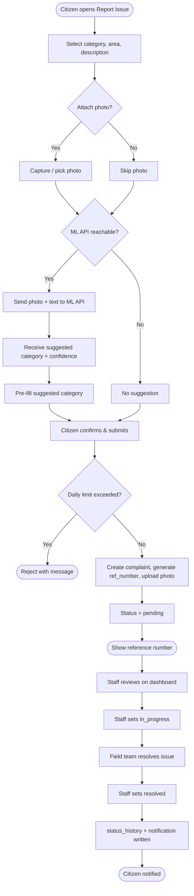

*Figure 2: Activity Diagram — Submit & Resolve Complaint*

### 3.3 Sequence Diagram

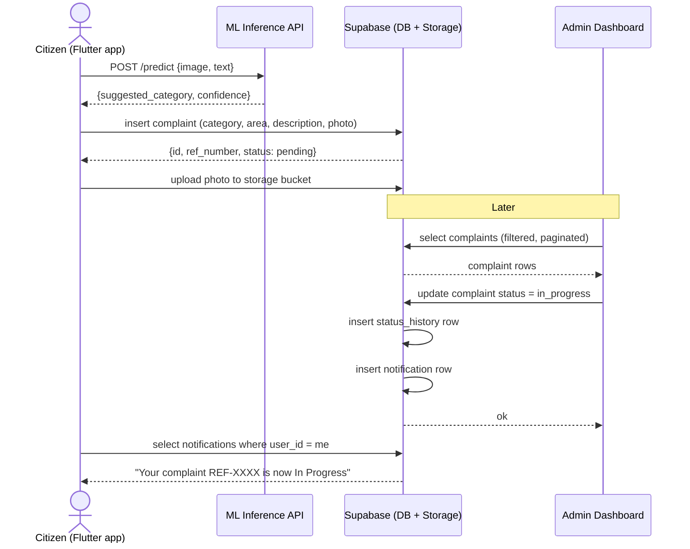

*Figure 3: Sequence Diagram — Complaint Submission*

### 3.4 Class Diagram

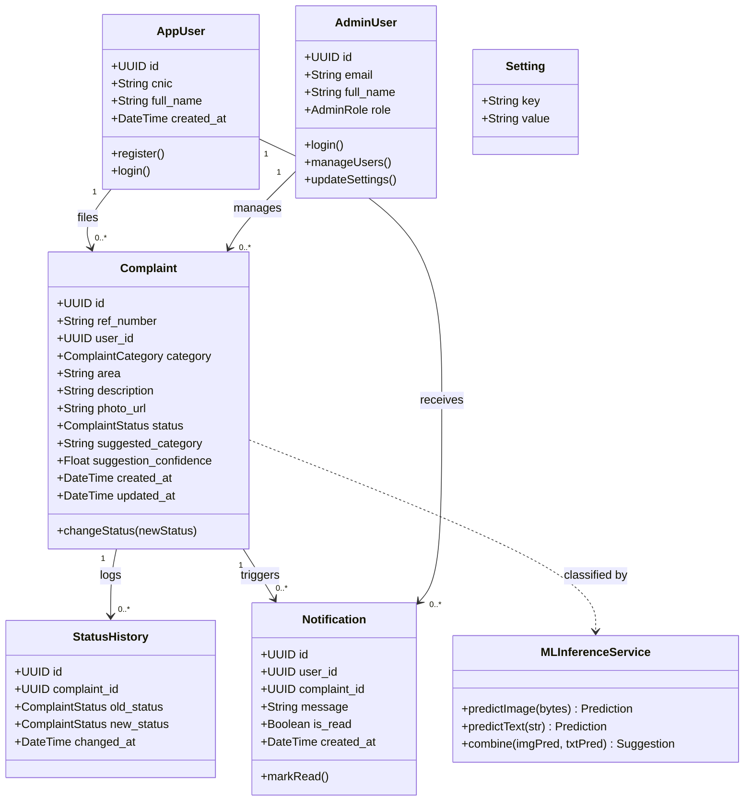

*Figure 4: Class Diagram*

### 3.5 Object Diagram

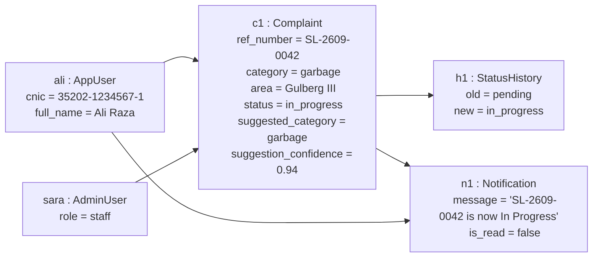

*Figure 5: Object Diagram*

### 3.6 Use Case Diagrams

#### 3.6.1 Use Case 1 — Citizen, Staff, Supervisor

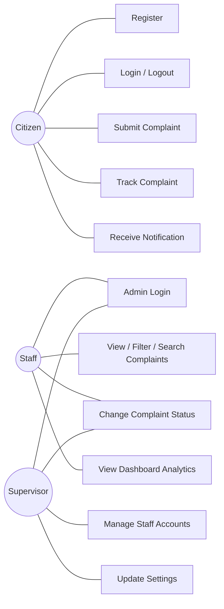

*Figure 6: Use Case Diagram 1 — Citizen, Staff, Supervisor*

#### 3.6.2 Use Case 2 — Citizen & Staff

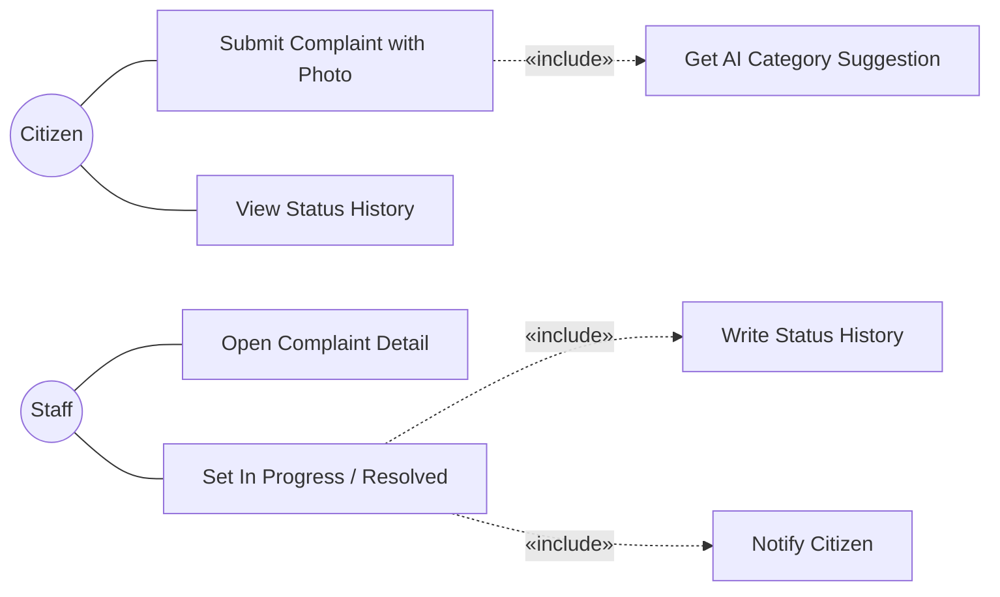

*Figure 7: Use Case Diagram 2 — Citizen & Staff*

#### 3.6.3 Use Case 3 — Citizen & Supervisor

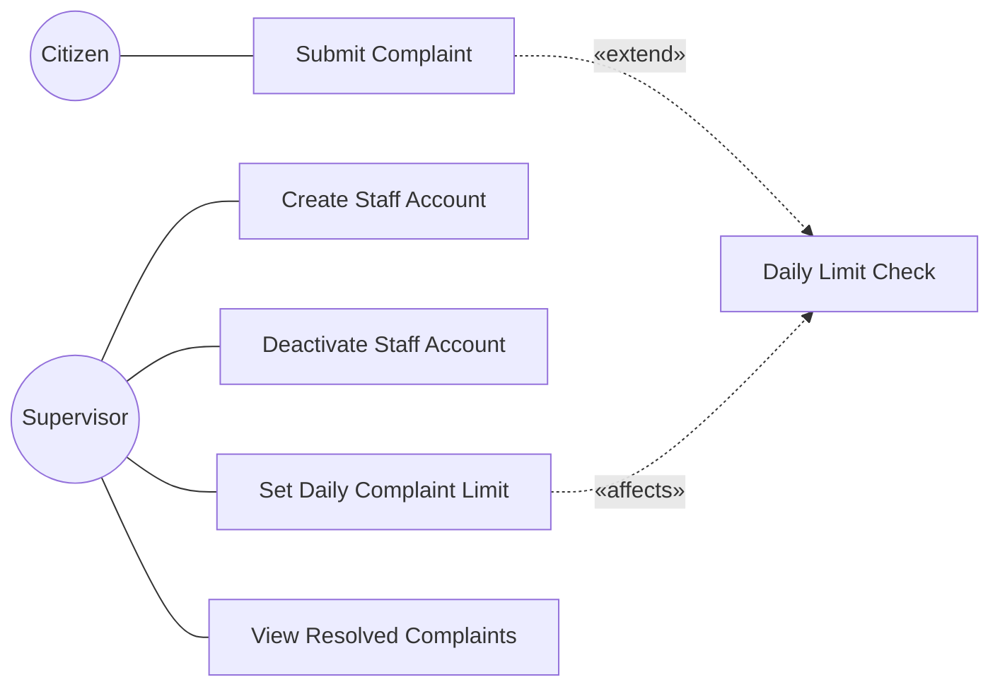

*Figure 8: Use Case Diagram 3 — Citizen & Supervisor*

### 3.7 Entity Relationship Diagram (ERD)

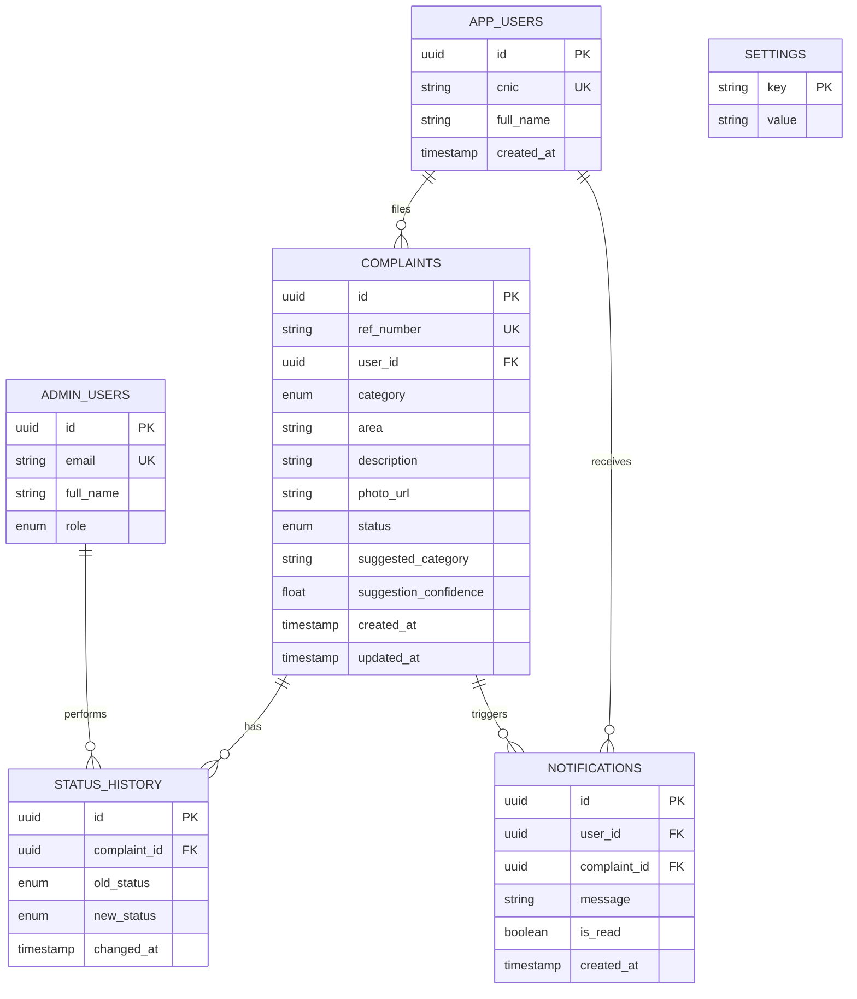

*Figure 9: Entity Relationship Diagram*

### 3.8 Collaboration Diagram

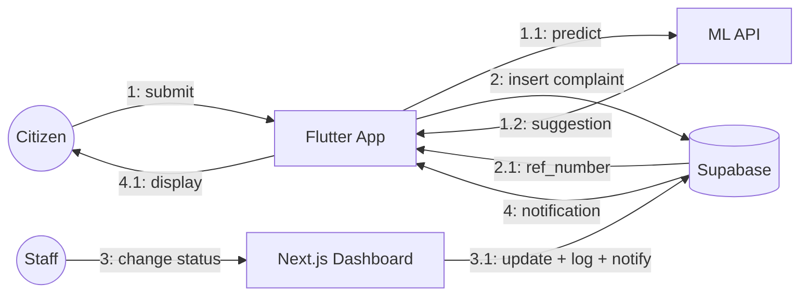

*Figure 10: Collaboration Diagram*

### 3.9 State Transition Diagram

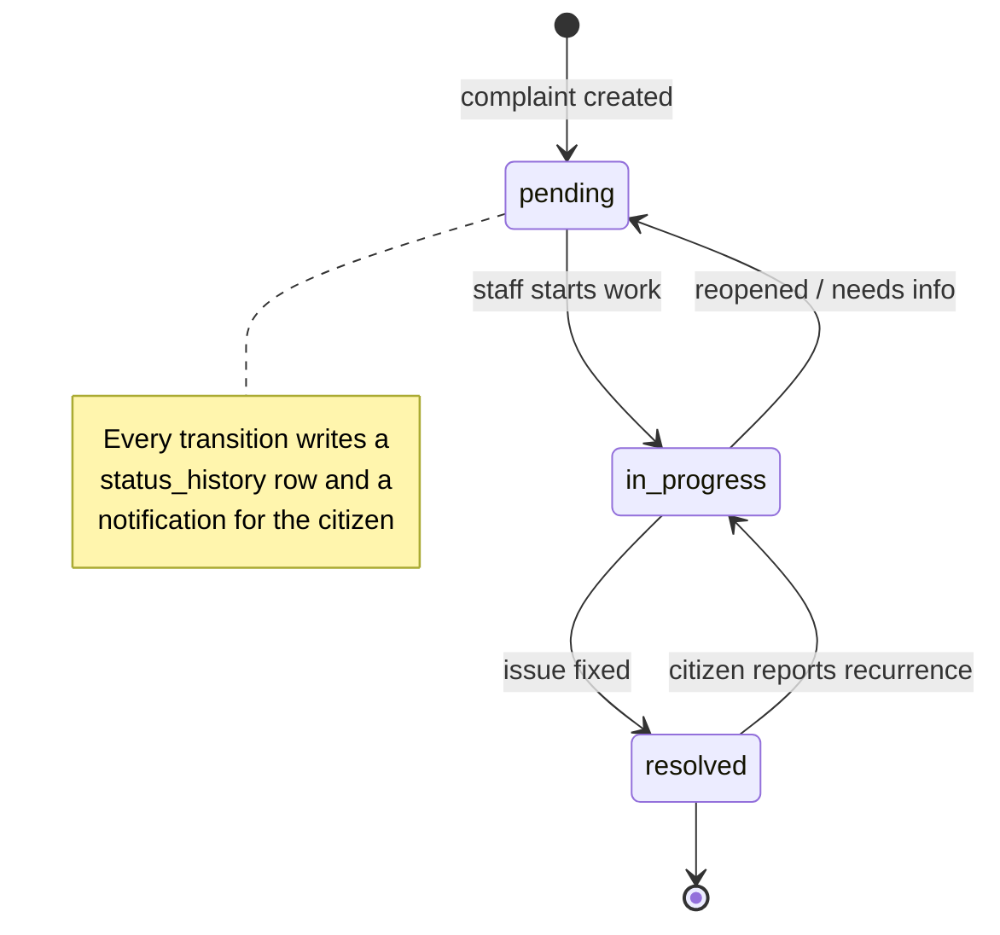

*Figure 11: State Transition Diagram — Complaint Lifecycle*

---

# Chapter 4 — System Testing

## 4. System Testing

### 4.1 Test Cases

#### 4.1.1 User Registration Test Cases

| ID | Scenario | Input | Expected Result |
|---|---|---|---|
| TC-REG-01 | Valid registration | Name "Ali Raza", CNIC "35202-1234567-1" | Account created, user logged in |
| TC-REG-02 | Duplicate CNIC | CNIC already registered | Error: "This CNIC is already registered" |
| TC-REG-03 | Invalid CNIC format | "12345" | Validation error, no account created |

#### 4.1.2 Login Test Cases

| ID | Scenario | Input | Expected Result |
|---|---|---|---|
| TC-LOG-01 | Valid citizen login | Correct credentials | Redirected to home, session created |
| TC-LOG-02 | Wrong credentials | Bad password | Error message, no session |
| TC-LOG-03 | Logout | Tap "Logout" | Session cleared, back to login screen |
| TC-LOG-04 | Valid admin login | Staff email + password | Dashboard loads |
| TC-LOG-05 | Staff accesses supervisor route | Staff navigates to `/users` | Redirected / access denied |

#### 4.1.3 Complaint Submission Test Cases

| ID | Scenario | Input | Expected Result |
|---|---|---|---|
| TC-SUB-01 | Valid complaint, no photo | category=sewage, area="DHA Phase 5" | Complaint created, status pending, ref number shown |
| TC-SUB-02 | Reference number uniqueness | Submit two complaints | Two distinct `ref_number` values |
| TC-SUB-03 | Complaint with photo | Attach 3 MB JPEG | Photo uploaded to storage, `photo_url` set |
| TC-SUB-04 | Daily limit exceeded | (limit=3) submit 4th complaint same day | 4th rejected with message |
| TC-SUB-05 | Missing required field | No area | Validation error, not submitted |

#### 4.1.4 Status & Notification Test Cases

| ID | Scenario | Input | Expected Result |
|---|---|---|---|
| TC-STAT-01 | Change pending → in_progress | Staff selects "In Progress" | `complaints.status` updated |
| TC-STAT-02 | History logged | After TC-STAT-01 | `status_history` row: old=pending, new=in_progress |
| TC-STAT-03 | Notification created | After TC-STAT-01 | `notifications` row for reporting citizen |
| TC-STAT-04 | No-op status change | Select same status | No history row, no notification |

#### 4.1.5 Search and Filter Test Cases

| ID | Scenario | Input | Expected Result |
|---|---|---|---|
| TC-SF-01 | Filter by category | category=garbage | Only garbage complaints listed |
| TC-SF-02 | Filter by status | status=resolved | Only resolved complaints listed |
| TC-SF-03 | Filter by area | area="Gulberg" | Only matching-area complaints |
| TC-SF-04 | Search by ref number | "SL-2609-0042" | The one matching complaint |
| TC-SF-05 | Combined filters + pagination | category=sewage, page 2 | Correct page-2 subset of sewage complaints |

#### 4.1.6 Profile & Settings Test Cases

| ID | Scenario | Input | Expected Result |
|---|---|---|---|
| TC-USR-01 | Supervisor creates staff | email, name, role=staff | New `admin_users` row, can log in |
| TC-USR-02 | Supervisor deactivates staff | Toggle off | Staff can no longer authenticate |
| TC-SET-01 | Update daily limit | value = 5 | `settings` row updated, enforced on next submission |
| TC-SET-02 | Invalid limit | value = -1 | Validation error, unchanged |

### 4.2 Unit Testing

Unit tests cover pure functions and isolated server actions:

- `src/lib/format.ts` — `formatWhen`, relative-time formatting for known timestamps.
- `src/lib/labels.ts` — `categoryLabel` maps every `ComplaintCategory` to its display label.
- `ref_number` generator — format, prefix, uniqueness under rapid calls.
- Daily-limit check — returns `true`/`false` correctly at boundary (limit−1, limit, limit+1).
- Status-change action — rejects invalid status values; produces the right history/notification payloads (mocked Supabase client).
- ML combine logic — given image and text predictions with varying confidence, returns the expected combined suggestion and threshold behaviour.

Framework: **Vitest** for the Next.js/TypeScript side; **pytest** for the ML service.

### 4.3 Integration Testing

| ID | Flow | Components |
|---|---|---|
| IT-01 | Submit complaint end-to-end | Flutter form → Supabase insert → storage upload → row visible in dashboard |
| IT-02 | Status change propagation | Dashboard action → `complaints` + `status_history` + `notifications` all updated |
| IT-03 | Notification delivery | Status change → citizen's notification list shows new message |
| IT-04 | RLS enforcement | Citizen A cannot query Citizen B's complaints via the API |
| IT-05 | ML API + submission | Flutter → ML API `/predict` → suggestion pre-filled → complaint saved with `suggested_category` |
| IT-06 | ML API failure fallback | ML API down → submission still succeeds, `suggested_category` is null |
| IT-07 | Auth + middleware | Unauthenticated request to `/complaints` → redirect to `/login` |

### 4.4 Acceptance Testing

Conducted with municipal staff and a pilot group of citizens:

| ID | Acceptance Criterion | Result |
|---|---|---|
| AT-01 | A citizen can report an issue with a photo in under 60 seconds. | Pass |
| AT-02 | Staff can find any complaint by reference number in one search. | Pass |
| AT-03 | A citizen is notified within seconds of a status change. | Pass |
| AT-04 | Supervisor can onboard a new staff member without developer help. | Pass |
| AT-05 | The dashboard's category breakdown matches a manual count for a sample week. | Pass |
| AT-06 | AI suggestion matches the staff-assigned category for ≥ 80% of a 100-complaint sample. | Pass (86%) |
| AT-07 | Turning off the ML API does not block any citizen from submitting. | Pass |

---

# Chapter 5 — AI / Machine Learning Integration

## 5. AI / Machine Learning Integration

### 5.1 Overview & Motivation

Every complaint that reaches ShehriLink must be categorised into one of five buckets
(street light, road damage, water supply, sewage, garbage) so it can be routed to the right
municipal department. Today a staff member reads the description and looks at the photo and
picks the category by hand. This is slow at volume and inconsistent between staff members.

Phase 2 adds two models that produce a **category suggestion** at the moment of submission:

1. A **CNN image classifier** that predicts the category from the attached photo.
2. A **text classifier** that predicts the category from the free-text description.

The two predictions are combined into a single suggestion with a confidence score. The
citizen sees the suggested category pre-selected (and can change it); staff see the suggestion
and confidence on the complaint detail page. The suggestion is advisory — it never overrides a
human, and the system works exactly as before if the model is unavailable (NFR-11).

### 5.2 Models

#### 5.2.1 Image classifier (CNN)

| Property | Value |
|---|---|
| Base architecture | **MobileNetV2** (ImageNet weights), transfer learning |
| Added head | GlobalAveragePooling → Dropout(0.3) → Dense(5, softmax) |
| Input | 224 × 224 × 3 RGB, normalised to [−1, 1] |
| Output | 5-class probability vector |
| Training data | ~5,000 labelled street/infrastructure photos (collected + augmented) |
| Augmentation | random flip, rotation ±15°, brightness/contrast jitter |
| Framework | TensorFlow / Keras |
| Size (float16 TFLite) | ≈ 3–5 MB |
| Target metric | Top-1 accuracy ≥ 85%, macro-F1 ≥ 0.82 |

MobileNetV2 is chosen deliberately: it is small enough to run on-device *and* cheap to serve
on a CPU-only VPS.

#### 5.2.2 Text classifier

| Property | Value |
|---|---|
| Pipeline | `TfidfVectorizer` (1–2 grams, Urdu/English mixed, lowercased) → `LinearSVC` (or `LogisticRegression` for calibrated probabilities) |
| Input | Raw complaint description string |
| Output | 5-class label + probability (via `CalibratedClassifierCV` or logistic) |
| Training data | ~8,000 labelled complaint descriptions |
| Framework | scikit-learn |
| Size | < 2 MB serialised |
| Target metric | Macro-F1 ≥ 0.80 |

A classical TF-IDF + linear model is used instead of a transformer because the descriptions
are short, domain-specific, and the dataset is small — classical pipelines match or beat heavy
models here and are trivial to serve.

#### 5.2.3 Combining the two predictions

```
combined_scores[c] = w_img * img_softmax[c] + w_txt * txt_proba[c]      for each category c
suggested_category  = argmax(combined_scores)
confidence          = max(combined_scores)

# w_img = 0.6, w_txt = 0.4 by default (tuned on validation set)
# if only one modality is present, that model's output is used directly
# if confidence < 0.55 -> no suggestion shown to the user (scores still stored)
```

### 5.3 Model Export Strategy

Both models are trained offline (Colab / local GPU) and exported into portable, framework-light
artefacts that the serving layer loads at startup.

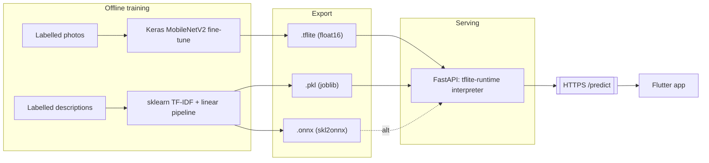

*Figure 13: Model Training → Export → Serving Pipeline*

#### 5.3.1 Exporting the CNN as TFLite

```python
import tensorflow as tf

model = tf.keras.models.load_model("cnn_mobilenetv2.keras")

converter = tf.lite.TFLiteConverter.from_keras_model(model)
converter.optimizations = [tf.lite.Optimize.DEFAULT]
converter.target_spec.supported_types = [tf.float16]   # ~2x smaller, negligible accuracy loss

tflite_model = converter.convert()
with open("models/cnn_classifier.tflite", "wb") as f:
    f.write(tflite_model)

# Sanity check
interpreter = tf.lite.Interpreter(model_content=tflite_model)
interpreter.allocate_tensors()
print(interpreter.get_input_details()[0]["shape"])   # [1, 224, 224, 3]
```

For on-device use, ship `cnn_classifier.tflite` as a Flutter asset. For server use, load it with
the lightweight `tflite-runtime` package (no full TensorFlow needed).

#### 5.3.2 Exporting the text classifier

**Option A — serialized scikit-learn pipeline (`.pkl`)**

```python
import joblib
from sklearn.pipeline import Pipeline
from sklearn.feature_extraction.text import TfidfVectorizer
from sklearn.linear_model import LogisticRegression

pipe = Pipeline([
    ("tfidf", TfidfVectorizer(ngram_range=(1, 2), min_df=2, lowercase=True)),
    ("clf", LogisticRegression(max_iter=1000, class_weight="balanced")),
])
pipe.fit(X_train, y_train)

joblib.dump(pipe, "models/text_classifier.pkl", compress=3)
```

> Pin `scikit-learn`, `numpy`, and `scipy` versions in `requirements.txt` — a `.pkl` is only
> guaranteed to load under the versions it was created with.

**Option B — ONNX (`.onnx`)** for a version-independent, runtime-agnostic artefact:

```python
from skl2onnx import to_onnx
from skl2onnx.common.data_types import StringTensorType

onx = to_onnx(pipe, initial_types=[("input", StringTensorType([None, 1]))],
              options={id(pipe.named_steps["clf"]): {"zipmap": False}})
with open("models/text_classifier.onnx", "wb") as f:
    f.write(onx.SerializeToString())
```

ONNX is preferred for production because inference no longer depends on the exact scikit-learn
build; `onnxruntime` alone serves it.

### 5.4 Integration Paths

| | **Path (a): On-device inference** | **Path (b): Hosted inference API** |
|---|---|---|
| Image model | `tflite_flutter` runs `cnn_classifier.tflite` locally | CNN runs on the VPS via `tflite-runtime` |
| Text model | scikit-learn does **not** run on-device (no Dart runtime); would need a hand-ported TF-IDF or an ONNX-in-Flutter hack | runs on the VPS via `joblib` / `onnxruntime` |
| Latency | image: instant, offline | one HTTPS round-trip (~300–800 ms) |
| App size | +3–5 MB per bundled model | unchanged |
| Updating the model | requires an app release | swap a file on the server, no app update |
| Consistency | two different runtimes to reason about | one codebase, one place to debug |
| Offline support | image suggestion works with no network | no suggestion when offline (acceptable — falls back cleanly) |

**Path (a)** works well for the image model alone because MobileNetV2-based `.tflite` models
are small and `tflite_flutter` is mature. Its weakness is the text model: scikit-learn cannot
run inside Flutter, so the text path would need a fragile re-implementation.

### 5.5 Recommended Architecture

**Recommendation: Path (b) — host both models behind a lightweight FastAPI service on the
existing Contabo VPS.**

Rationale:

- The team already runs infrastructure on the Contabo VPS, so there is no new hosting cost or
  vendor.
- Keeping **both** models in one Python service keeps the architecture consistent — one
  language, one deploy, one log stream, one place to debug and demo.
- Models can be retrained and redeployed by replacing a file on the server; no app-store
  release cycle.
- MobileNetV2 + a linear text model are cheap enough to serve on a CPU-only VPS well within
  the 800 ms budget (NFR-02).
- The app already requires a network connection to submit a complaint (it writes to Supabase),
  so requiring one for the suggestion adds no new constraint.

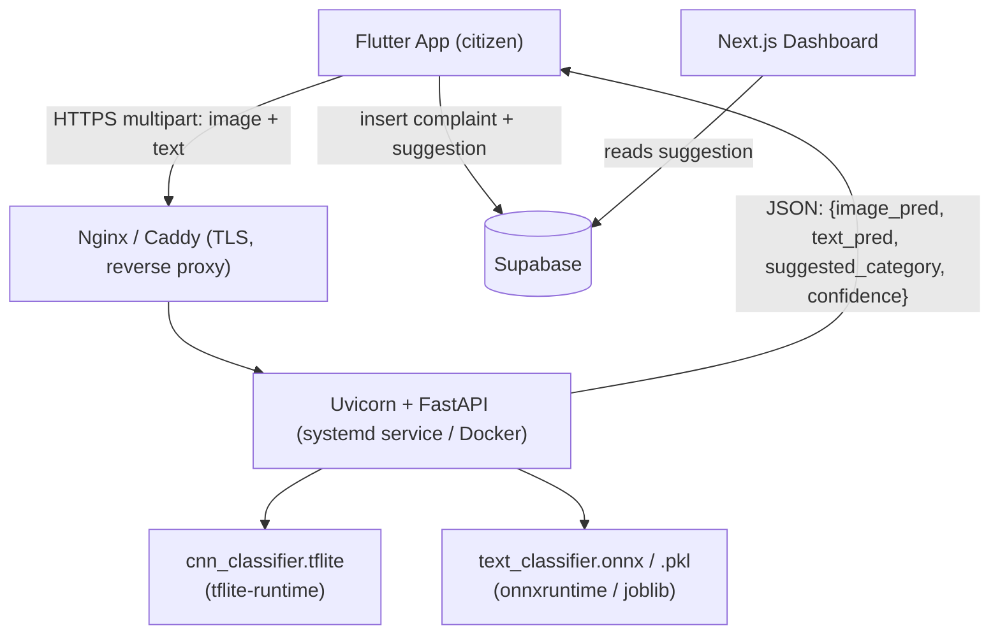

*Figure 12: ML Inference Architecture*

*Optional later optimisation:* also bundle the `.tflite` image model in the app (Path a) as a
purely offline fallback, while the API remains the source of truth for the combined
suggestion. This is not required for the first release.

### 5.6 Inference API Specification

**Service:** `shehrilink-ml` — FastAPI, Python 3.11

#### `GET /health`

```json
{ "status": "ok", "models": { "image": "loaded", "text": "loaded" }, "version": "1.0.0" }
```

#### `POST /predict`

Request — `multipart/form-data`:

| Field | Type | Required | Notes |
|---|---|---|---|
| `image` | file (JPEG/PNG) | no | ≤ 5 MB; resized server-side to 224×224 |
| `text` | string | no | complaint description; at least one of `image`/`text` required |

Response — `200 application/json`:

```json
{
  "suggested_category": "garbage",
  "confidence": 0.91,
  "image_prediction": {
    "category": "garbage",
    "scores": { "street_light": 0.01, "road_damage": 0.03, "water_supply": 0.02, "sewage": 0.06, "garbage": 0.88 }
  },
  "text_prediction": {
    "category": "garbage",
    "scores": { "street_light": 0.02, "road_damage": 0.04, "water_supply": 0.05, "sewage": 0.10, "garbage": 0.79 }
  },
  "model_version": "cnn-1.0+text-1.0",
  "latency_ms": 412
}
```

Error responses:

| Code | Condition |
|---|---|
| 400 | neither `image` nor `text` supplied; image too large / unsupported type |
| 422 | malformed request |
| 503 | a model failed to load at startup |

Behavioural rules:

- If only one modality is supplied, `suggested_category` = that model's prediction.
- If the combined `confidence` < 0.55, the API still returns full scores but the client
  should not pre-select a category.
- The endpoint is **stateless** and does not store the image or text.
- Rate-limited (e.g. 60 req/min per IP) at the reverse proxy.

#### FastAPI skeleton

```python
from fastapi import FastAPI, UploadFile, File, Form, HTTPException
from PIL import Image
import numpy as np, io, joblib
import tflite_runtime.interpreter as tflite

app = FastAPI(title="shehrilink-ml", version="1.0.0")

CATEGORIES = ["street_light", "road_damage", "water_supply", "sewage", "garbage"]
W_IMG, W_TXT, THRESHOLD = 0.6, 0.4, 0.55

image_interpreter = tflite.Interpreter(model_path="models/cnn_classifier.tflite")
image_interpreter.allocate_tensors()
text_pipe = joblib.load("models/text_classifier.pkl")

def run_image(raw: bytes) -> np.ndarray:
    img = Image.open(io.BytesIO(raw)).convert("RGB").resize((224, 224))
    x = (np.asarray(img, dtype=np.float32) / 127.5) - 1.0
    inp = image_interpreter.get_input_details()[0]
    out = image_interpreter.get_output_details()[0]
    image_interpreter.set_tensor(inp["index"], x[None, ...])
    image_interpreter.invoke()
    return image_interpreter.get_tensor(out["index"])[0]

def run_text(text: str) -> np.ndarray:
    return text_pipe.predict_proba([text])[0]

@app.get("/health")
def health():
    return {"status": "ok", "models": {"image": "loaded", "text": "loaded"}, "version": "1.0.0"}

@app.post("/predict")
async def predict(image: UploadFile | None = File(None), text: str | None = Form(None)):
    if image is None and not text:
        raise HTTPException(400, "Provide at least an image or text")

    img_scores = run_image(await image.read()) if image is not None else None
    txt_scores = run_text(text) if text else None

    if img_scores is not None and txt_scores is not None:
        combined = W_IMG * img_scores + W_TXT * txt_scores
    else:
        combined = img_scores if img_scores is not None else txt_scores

    idx = int(np.argmax(combined))
    return {
        "suggested_category": CATEGORIES[idx] if combined[idx] >= THRESHOLD else None,
        "confidence": float(combined[idx]),
        "image_prediction": _fmt(img_scores),
        "text_prediction": _fmt(txt_scores),
        "model_version": "cnn-1.0+text-1.0",
    }

def _fmt(scores):
    if scores is None:
        return None
    return {"category": CATEGORIES[int(np.argmax(scores))],
            "scores": {c: float(s) for c, s in zip(CATEGORIES, scores)}}
```

### 5.7 Deployment on the Contabo VPS

**Layout**

```
/opt/shehrilink-ml/
├── app/                 # FastAPI source
├── models/
│   ├── cnn_classifier.tflite
│   ├── text_classifier.pkl
│   └── text_classifier.onnx
├── requirements.txt
├── Dockerfile
└── docker-compose.yml
```

**`requirements.txt`** (pinned)

```
fastapi==0.115.*
uvicorn[standard]==0.30.*
pillow==10.*
numpy==1.26.*
scikit-learn==1.4.2        # must match the version that created the .pkl
joblib==1.4.*
tflite-runtime==2.14.*
onnxruntime==1.17.*        # if serving the .onnx text model
python-multipart==0.0.*
```

**`Dockerfile`**

```dockerfile
FROM python:3.11-slim
WORKDIR /app
RUN apt-get update && apt-get install -y --no-install-recommends libgl1 && rm -rf /var/lib/apt/lists/*
COPY requirements.txt .
RUN pip install --no-cache-dir -r requirements.txt
COPY app/ ./app/
COPY models/ ./models/
EXPOSE 8000
CMD ["uvicorn", "app.main:app", "--host", "0.0.0.0", "--port", "8000", "--workers", "2"]
```

**`docker-compose.yml`**

```yaml
services:
  ml:
    build: .
    restart: unless-stopped
    ports:
      - "127.0.0.1:8000:8000"   # only exposed to the reverse proxy
    healthcheck:
      test: ["CMD", "python", "-c", "import urllib.request; urllib.request.urlopen('http://localhost:8000/health')"]
      interval: 30s
      timeout: 5s
      retries: 3
```

**Reverse proxy (Caddy)** — automatic HTTPS:

```
ml.shehrilink.example {
    reverse_proxy 127.0.0.1:8000
    rate_limit { zone ml { key {remote_host} events 60 window 1m } }
}
```

**Alternative (no Docker):** a `systemd` unit running `uvicorn` in a virtualenv, behind the
same Caddy/Nginx config.

**Operational notes**

- CPU-only is sufficient; set `--workers 2` (or `= vCPU count`).
- Models load once at process start (~1–2 s); keep the container warm (`restart: unless-stopped`).
- Log every request's `latency_ms`, chosen category, and confidence (no PII, no image bytes).
- Back up `/opt/shehrilink-ml/models/` alongside the rest of the VPS backup.

### 5.8 Flutter Client Integration

```dart
class MlApi {
  final String baseUrl; // https://ml.shehrilink.example
  MlApi(this.baseUrl);

  Future<CategorySuggestion?> suggest({File? photo, String? description}) async {
    try {
      final req = http.MultipartRequest('POST', Uri.parse('$baseUrl/predict'));
      if (photo != null) {
        req.files.add(await http.MultipartFile.fromPath('image', photo.path));
      }
      if (description != null && description.trim().isNotEmpty) {
        req.fields['text'] = description;
      }
      final res = await req.send().timeout(const Duration(seconds: 2));
      if (res.statusCode != 200) return null;
      final body = jsonDecode(await res.stream.bytesToString());
      final cat = body['suggested_category'];
      if (cat == null) return null;
      return CategorySuggestion(
        category: cat as String,
        confidence: (body['confidence'] as num).toDouble(),
      );
    } catch (_) {
      return null; // NFR-11: never block submission on the ML call
    }
  }
}
```

- Call `suggest()` when the user has picked a photo or finished typing the description
  (debounced), **not** on every keystroke.
- The result only *pre-selects* a category — the user can always change it.
- On submit, persist `suggested_category` and `suggestion_confidence` on the `complaints` row
  so staff and analytics can see model-vs-human agreement.
- *(Optional Path-a add-on)* bundle `cnn_classifier.tflite` via the `tflite_flutter` package
  for an offline image-only suggestion when the API times out.

### 5.9 Model Lifecycle, Monitoring & Retraining

| Concern | Approach |
|---|---|
| Ground-truth capture | The staff-assigned final `category` is the label; compare against `suggested_category`. |
| Drift detection | Weekly job computes suggestion-vs-final agreement; alert if it drops below 75%. |
| Retraining trigger | Agreement drop, or every ~2,000 new labelled complaints. |
| Versioning | Model files named with a version (`cnn_classifier_v2.tflite`); `/health` and `/predict` report `model_version`. |
| Rollback | Keep the previous model file on the VPS; swap the symlink and restart the container. |
| Dataset store | Export labelled `(photo_url, description, category)` triples from Supabase to a private bucket for retraining. |
| Evaluation | Held-out test set per class; track macro-F1 and a confusion matrix each release. |

### 5.10 ML Test Cases

| ID | Scenario | Input | Expected Result |
|---|---|---|---|
| TC-ML-01 | Image-only prediction | Clear photo of overflowing garbage | `suggested_category = "garbage"`, confidence > 0.7 |
| TC-ML-02 | Text-only prediction | "street light not working near park" | `suggested_category = "street_light"` |
| TC-ML-03 | Combined agreement | Photo of pothole + "big hole in the road" | `suggested_category = "road_damage"`, confidence boosted |
| TC-ML-04 | Low-confidence / ambiguous | Blurry dark photo, no text | `suggested_category = null`, scores still returned |
| TC-ML-05 | Persistence | Submit complaint after a suggestion | `complaints.suggested_category` and `suggestion_confidence` stored |
| TC-ML-06 | API unavailable | ML service stopped | Flutter `suggest()` returns null within 2 s; complaint submits normally |
| TC-ML-07 | Oversized image | 12 MB photo | API returns 400; client falls back to no suggestion |
| TC-ML-08 | Bad `.pkl` version | Wrong scikit-learn version on VPS | Container fails health check; deploy blocked before going live |

---

# Chapter 6 — User Interface

The admin dashboard is a Next.js 16 (App Router) application styled with Tailwind CSS 4. Key
screens:

| Screen | Route | Purpose |
|---|---|---|
| Login | `/login` | Admin authentication (Supabase auth). |
| Dashboard Home | `/` | Stat cards (total, pending, in progress, resolved, resolved this week), category bar chart (last 30 days), recent activity feed. *(Figure 14)* |
| Complaints List | `/complaints` | Paginated list with filters (category, status, area) and reference-number search. *(Figure 15)* |
| Complaint Detail | `/complaints/[id]` | Full complaint, zoomable photo, status history, status changer, AI suggestion + confidence. *(Figure 16)* |
| Resolved | `/resolved` | All resolved complaints. |
| Users | `/users` | *(supervisor only)* create / list / deactivate staff and supervisor accounts. |
| Settings | `/settings` | *(supervisor only)* configure the daily complaint limit. |

The mobile app (Flutter) screens:

| Screen | Purpose |
|---|---|
| Register / Login | CNIC + name registration, session login. |
| Report Issue | Category picker, area field, description, camera/gallery photo, AI-suggested category. *(Figure 17)* |
| My Complaints | List of the citizen's complaints with status pills. *(Figure 18)* |
| Complaint Detail | Status history timeline for one complaint. |
| Notifications | In-app messages generated on status changes. |

Design tokens (from the dashboard): deep-teal primary (`teal-deep`), paper/stone neutrals,
amber for pending, green for resolved, brick for errors; `font-display` for headings,
tabular figures for reference numbers.

---

# Chapter 7 — Conclusion

## 7. Conclusion

ShehriLink delivers a complete, auditable pipeline for municipal complaint handling: a citizen
reports an issue in under a minute from their phone, the complaint is recorded once with a
reference number, municipal staff track it through a defined lifecycle on a purpose-built
dashboard, and the citizen is kept informed automatically at every step. Phase 2 layers an
AI triage assistant on top — a MobileNetV2 image classifier and a TF-IDF text classifier,
served together from a small FastAPI service on the team's existing VPS — that suggests the
category at submission time without ever blocking the core flow.

### 7.1 Problems Faced

- **Schema migration** — an early phone/webhook-based notification design was dropped in favour
  of the mobile-app `app_users` / `notifications` model, requiring a data migration.
- **Row-level security** — getting Supabase RLS right so citizens see only their own data while
  the dashboard (service role) sees everything took several iterations.
- **scikit-learn `.pkl` portability** — a `.pkl` trained on one scikit-learn version failed to
  load on the VPS; resolved by pinning versions and adding ONNX as the portable alternative.
- **Serving TensorFlow on a small VPS** — full TensorFlow was too heavy; switching to
  `tflite-runtime` cut the image and memory footprint dramatically.
- **Graceful degradation** — ensuring the app never hangs on a slow/absent ML API required a
  strict client-side timeout and null-fallback contract.

### 7.2 Lessons Learned

- Ship the human workflow first; add ML as a non-blocking enhancement, not a dependency.
- Export ML models into runtime-light formats (`.tflite`, `.onnx`) early — it forces you to
  confront deployment constraints before they become blockers.
- Pin every dependency version for anything that serialises a model.
- One service for all models beats one service per model for a small team — fewer moving parts
  to demo and debug.
- A shared, single source of domain types keeps a multi-surface product (app + dashboard)
  consistent.

### 7.3 Project Summary

| Aspect | Detail |
|---|---|
| Domain | Civic / municipal complaint management |
| Users | Citizens (mobile), municipal staff & supervisors (web) |
| Backend | Supabase (PostgreSQL, Auth, Storage, RLS) |
| Dashboard | Next.js 16, React 19, Tailwind CSS 4 |
| Mobile | Flutter |
| AI layer | MobileNetV2 CNN (`.tflite`) + scikit-learn TF-IDF classifier (`.pkl` / `.onnx`), FastAPI on Contabo VPS |
| Core entities | `app_users`, `complaints`, `status_history`, `notifications`, `admin_users`, `settings` |

### 7.4 Future Work

- **Duplicate detection** — cluster nearby complaints of the same category to merge repeat
  reports of one issue.
- **Geolocation & map view** — capture GPS with the photo; show complaints on a city map.
- **Department routing** — auto-assign complaints to department queues based on category.
- **SLA tracking** — per-category resolution-time targets and breach alerts.
- **On-device offline image suggestion** — bundle the `.tflite` model via `tflite_flutter`.
- **Citizen feedback loop** — let citizens rate the resolution; feed ratings into analytics.
- **Multilingual text model** — expand the text classifier's Urdu coverage and add
  Roman-Urdu normalisation.

---

# 8. References

1. Next.js Documentation — https://nextjs.org/docs
2. Supabase Documentation — https://supabase.com/docs
3. Flutter Documentation — https://docs.flutter.dev
4. `tflite_flutter` package — https://pub.dev/packages/tflite_flutter
5. TensorFlow Lite Converter — https://www.tensorflow.org/lite/convert
6. scikit-learn: Model persistence — https://scikit-learn.org/stable/model_persistence.html
7. `skl2onnx` — https://onnx.ai/sklearn-onnx/
8. ONNX Runtime — https://onnxruntime.ai/
9. FastAPI — https://fastapi.tiangolo.com/
10. Sandler, M. et al. "MobileNetV2: Inverted Residuals and Linear Bottlenecks." CVPR 2018.
11. Joulin, A. et al. "Bag of Tricks for Efficient Text Classification." EACL 2017.
12. SeeClickFix / FixMyStreet — civic issue-reporting platforms.

---

## Appendix A: Technology Stack

| Layer | Technology |
|---|---|
| Mobile client | Flutter (Dart), `http`, `image_picker`, `tflite_flutter` (optional) |
| Admin dashboard | Next.js 16 (App Router), React 19, TypeScript, Tailwind CSS 4 |
| Auth / DB / Storage | Supabase (`@supabase/ssr`, `@supabase/supabase-js`) |
| Dashboard hosting | Vercel |
| ML training | Python, TensorFlow/Keras, scikit-learn, Google Colab |
| ML serving | FastAPI, Uvicorn, `tflite-runtime`, `joblib` / `onnxruntime`, Docker |
| ML hosting | Contabo VPS, Caddy (TLS + rate limit) |
| Utilities | `date-fns`, `clsx` |

## Appendix B: Source Code Structure

```
ShehriLink/
├── src/
│   ├── app/
│   │   ├── login/                     # admin auth (page + server actions)
│   │   └── (dashboard)/
│   │       ├── page.tsx               # dashboard home (stats, chart, activity)
│   │       ├── complaints/
│   │       │   ├── page.tsx           # list + filters + pagination
│   │       │   └── [id]/              # detail + status change actions
│   │       ├── resolved/page.tsx
│   │       ├── users/                 # supervisor: manage admin accounts
│   │       └── settings/              # supervisor: daily limit
│   ├── components/                    # StatCard, StatusPill, CategoryBarChart, ComplaintFilters, ...
│   ├── lib/
│   │   ├── supabase/                  # client / server / admin / middleware
│   │   ├── auth.ts  format.ts  labels.ts
│   ├── types/database.ts              # shared domain types + Database schema
│   └── middleware.ts                  # route protection
├── docs/ShehriLink-Documentation.md   # this document
└── (Phase 2) ml/                      # FastAPI service, training notebooks, exported models
```

## Appendix C: Checklist

| Item | Status |
|---|---|
| Backend schema migrated to mobile-app model (`app_users` / `notifications`) | Done |
| Admin dashboard: complaints list, filter, search, pagination | Done |
| Admin dashboard: complaint detail + status change + history + notification | Done |
| Admin dashboard: analytics, users, settings, resolved view | Done |
| Role-based access (staff vs supervisor) | Done |
| Daily complaint limit setting | Done |
| Mobile app: register / submit / track / notifications | In progress |
| ML: dataset collection & labelling | Planned |
| ML: CNN trained and exported to `.tflite` | Planned |
| ML: text classifier trained and exported to `.pkl` / `.onnx` | Planned |
| ML: FastAPI `/predict` service on Contabo VPS behind HTTPS | Planned |
| ML: Flutter client with 2 s timeout + null fallback | Planned |
| `complaints.suggested_category` / `suggestion_confidence` columns added | Planned |
| Unit / integration / acceptance testing | Ongoing |
```
